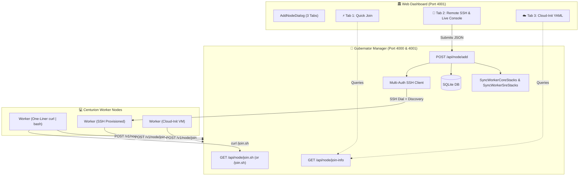

# SPEC-node-onboarding.md — Gubernator Universal Centurion Onboarding Subsystem Specification

## 1. Overview & Vision

Gubernator's **Universal Centurion Onboarding Subsystem** provides a zero-friction, multi-workflow mechanism to register, provision, and bootstrap Worker nodes (*Centurions*) into a Gubernator cluster.

The subsystem bridges three complementary onboarding paradigms:
1. **Outbound "Phone Home" Auto-Join (Quick Join)**: Workers initiate outbound connections to the Manager, bypassing all NAT, firewall, and SSH configuration hurdles.
2. **Push-Based Remote SSH Provisioning**: Manager orchestrates discovery, Docker installation, agent deployment, and system stack bootstrap over SSH with an interactive Linux monospace terminal streaming live progress.
3. **Infrastructure as Code (Cloud-Init)**: Declarative `#cloud-config` blueprints for automated provisioning on Proxmox VE, OpenStack, AWS EC2, GCP, Hetzner Cloud, and Terraform.

---

## 2. Architectural Design



---

## 3. Onboarding Workflows

### 3.1 Workflow A: Quick Join (Outbound "Phone Home")
* **Target Audience**: Cloud VMs, on-premise servers behind NAT, or environments with restricted inbound SSH.
* **Mechanism**:
  1. Worker executes `curl -fsSL http://<MANAGER-IP>:4001/api/node/join.sh | sudo bash -s -- --manager http://<MANAGER-IP>:4000 --token <JOIN_TOKEN> --api-token <API_TOKEN>`.
  2. Script verifies or installs Docker CE Engine (`curl -fsSL https://get.docker.com | sudo sh`).
  3. Launches container `marioezquerro/gubernator:latest legion join` or native binary.
  4. Worker registers with `POST /v1/node/join` and starts heartbeat (10s) and task executor (5s) background loops.

### 3.2 Workflow B: Remote SSH Provisioning & Live Terminal Console
* **Target Audience**: Administrators adding nodes centrally from the Web Dashboard.
* **Supported Auth Methods**:
  * `password`: Standard username & password (with automatic sudo elevation).
  * `private_key`: Custom OpenSSH RSA / ED25519 PEM private key.
  * `manager_key`: Manager's internal key (`/data/ssh/id_ed25519.pub` / `~/.ssh/id_ed25519`).
* **Live Step-by-Step Execution Sequence**:
  1. **SSH Connection & Handshake**: Dial TCP `host:port` with configured credentials.
  2. **Hardware Discovery**: Runs `hostname && uname -m && nproc && free -m`.
  3. **Cluster Registry**: Inserts or updates `db.Node` record in SQLite.
  4. **Docker Engine Check**: Verifies Docker CE runtime, auto-installing if absent.
  5. **Worker Agent Deployment**: Runs `marioezquerro/gubernator:latest legion join`.
  6. **System Stacks Bootstrap**: Spawns `CORE-GBNT` (Caddy Ingress) and `[SRE] Monitor` (Promtail, Node-Exporter, cAdvisor).
  7. **Aqueducts & Telemetry**: Updates CoreDNS zone records and reloads Prometheus scrape configuration.

### 3.3 Workflow C: Cloud-Init & Automation (IaC)
* **Target Audience**: Automated infrastructure pipelines (Terraform, Ansible, Proxmox VE templates, AWS Auto-Scaling).
* **Snippet Format**:
  ```yaml
  #cloud-config
  package_upgrade: true
  packages:
    - curl
    - docker.io
  runcmd:
    - systemctl enable --now docker
    - sudo docker run -d --name gbnt-worker --network host --restart unless-stopped -v /var/run/docker.sock:/var/run/docker.sock -v /data:/data marioezquerro/gubernator:latest legion join --token <JOIN_TOKEN> --manager http://<MANAGER-IP>:4000 --api-token <API_TOKEN>
  ```

---

## 4. API Specification

### 4.1 `GET /api/node/join-info`
* **Auth**: None / Authenticated session
* **Response**:
  ```json
  {
    "manager_ip": "192.168.252.31",
    "manager_http": "http://192.168.252.31:4000",
    "join_token": "a5de2fa005093ed6d9957017f275682a",
    "api_token": "my-gubernator-api-token",
    "manager_public_key": "ssh-ed25519 AAAAC3NzaC1lZDI1NTE5AAAAICMkCVTvynh2z8bAgMV9MydLFld39yQ+D0H5/Q3m2TMJ",
    "one_liner_cmd": "curl -fsSL http://192.168.252.31:4001/api/node/join.sh | sudo bash -s -- --manager http://192.168.252.31:4000 --token a5de2fa005093ed6d9957017f275682a --api-token my-gubernator-api-token",
    "docker_cmd": "sudo docker run -d --name gbnt-worker --network host --restart unless-stopped -v /var/run/docker.sock:/var/run/docker.sock -v /data:/data marioezquerro/gubernator:latest legion join --token a5de2fa005093ed6d9957017f275682a --manager http://192.168.252.31:4000 --api-token my-gubernator-api-token",
    "cli_cmd": "sudo gbnt legion join --token a5de2fa005093ed6d9957017f275682a --manager http://192.168.252.31:4000 --api-token my-gubernator-api-token",
    "cloud_init_yaml": "#cloud-config\n..."
  }
  ```

### 4.2 `GET /join.sh` (or `GET /api/node/join.sh`)
* **Auth**: Public
* **Response**: Standalone executable POSIX shell script (`text/x-shellscript`).

### 4.3 `POST /api/node/add`
* **Auth**: Admin JWT or Bearer API token
* **Request Body**:
  ```json
  {
    "host": "192.168.252.34",
    "port": "22",
    "user": "ubuntu",
    "auth_type": "password",
    "password": "ubuntu",
    "private_key": "",
    "deploy_system_stacks": true
  }
  ```
* **Response Body**:
  ```json
  {
    "success": true,
    "message": "Node successfully provisioned and joined cluster",
    "logs": [
      { "step": "SSH Connection", "message": "Connecting to 192.168.252.34:22 as user 'ubuntu'...", "status": "ok" },
      { "step": "SSH Handshake", "message": "SSH session established securely.", "status": "ok" },
      { "step": "Hardware Discovery", "message": "Detected hostname 'gbnt-worker3', 2 CPU cores, 1955 MB RAM.", "status": "ok" },
      { "step": "Cluster Registry", "message": "Registered Centurion 'node-gbnt-worker3' in database.", "status": "ok" },
      { "step": "Docker Engine", "message": "Docker CE runtime is installed and operational.", "status": "ok" },
      { "step": "Agent Deployment", "message": "Gubernator Centurion worker container deployed and running.", "status": "ok" },
      { "step": "System Stacks", "message": "Bootstrapping CORE-GBNT (Caddy) and SRE Monitor services...", "status": "ok" },
      { "step": "Aqueducts & Telemetry", "message": "Updating CoreDNS routing and Prometheus metric scraping targets...", "status": "ok" },
      { "step": "Complete", "message": "Centurion 'node-gbnt-worker3' successfully provisioned and online!", "status": "ok" }
    ],
    "node": {
      "id": "node-gbnt-worker3",
      "ip": "192.168.252.34",
      "role": "worker",
      "status": "active"
    }
  }
  ```

---

## 5. Security & Isolation

1. **One-Time Handshake Token (`JoinToken`)**:
   * The join token is exclusively used during the initial registration handshake (`POST /v1/node/join`).
   * Once joined, all ongoing communications (heartbeats, container telemetry, task assignments) use cryptographically signed Bearer API tokens.
2. **Private Key Storage & Security**:
   * Private keys submitted via the UI for SSH provisioning are never persisted to disk or the database; they are held strictly in ephemeral memory for the duration of the SSH dial session.
3. **Public Script Sanitization**:
   * The public `/join.sh` endpoint only serves logic to start the worker with explicit parameters; no cluster secrets or private configuration files are exposed.
