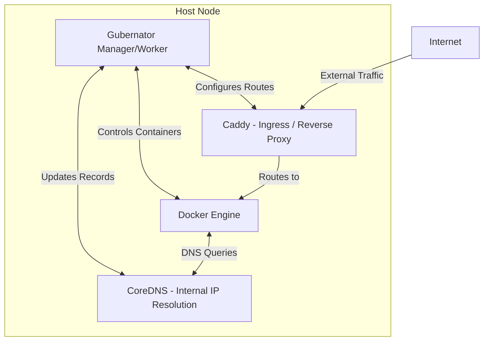

# Gubernator (gbnt) - Architecture

## High-Level Overview

Gubernator is an orchestrator designed to provide the simplicity of Docker Swarm with the flexibility of Nomad. It operates by managing Docker containers across a cluster of nodes using a centralized manager pattern with resilient edge workers.

### Core Components

1. **Gubernator Manager (The Senate/Forum)**
   - Exposes the REST API (Port 4000) for the `gbnt` CLI.
   - Maintains the global state of the cluster using **SQLite**.
   - Handles the Scheduling logic (matching labels and resources).
   - Monitors node heartbeats and container health.

2. **Gubernator Worker (The Centurions)**
   - The same `gbnt` binary running in worker mode.
   - Communicates with the local Docker Engine API to spin up/down containers.
   - Maintains a local SQLite cache ("Draft Mode") to keep existing tasks running even if the Manager is unreachable.

3. **Networking & Ingress (The Aqueducts)**
   - **CoreDNS:** Deployed alongside Gubernator to provide internal DNS resolution for all containers. Gubernator updates CoreDNS dynamically as tasks start/stop.
   - **Caddy:** Acts as the automated Ingress proxy. Gubernator configures Caddy automatically based on service routing labels to expose services externally.

4. **Observability (The Watchtowers)**
   - OpenTelemetry metrics, Healthchecks, and Swagger endpoints (Port 4002).

## Node Architecture (The Minimal Deployment)

A typical host running Gubernator will have the following foundational stack:

## Data Model (SQLite State)

The state is stored centrally in SQLite on the Manager, with tables mapping out the orchestration state:

- **Nodes:** Information about cluster members, roles, status, and hardware/AI labels.
- **Stacks:** Declarative `docker-compose.yml` definitions.
- **Services:** Desired state (image, replicas, placement constraints).
- **Tasks:** Actual container instances assigned to specific nodes.

## Workflow: Deploying a Stack

1. **CLI Execution:** User runs `gbnt stack deploy -c compose.yml my_stack`.
2. **API Reception:** Manager receives the Compose file via REST API (Port 4000).
3. **Parsing:** Manager parses the Compose file into Services.
4. **Scheduling:** Manager matches service constraints (e.g., `gbnt.node.gpu=nvidia`) against Node labels.
5. **Task Creation:** Tasks are written to the SQLite DB and assigned to specific Node IDs.
6. **Worker Execution:** Workers pull the Task assignment from the DB and instruct their local Docker Engine to start the container.
7. **DNS Update:** Gubernator updates CoreDNS so other containers can resolve the new service.
8. **Ingress Update:** If the Compose file dictates public routing (via labels), Gubernator updates Caddy's configuration to expose it.
