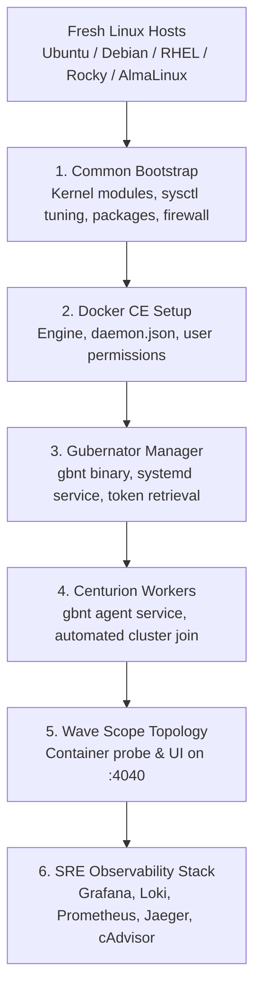

# Automated Cluster Provisioning with Ansible

Gubernator provides a complete suite of production-ready Ansible playbooks and modular roles located in the [`ansible/`](https://github.com/mario-ezquerro/gubernator/tree/main/ansible) directory. These playbooks automate the preparation of fresh Linux hosts (Debian/Ubuntu, RHEL/Rocky/AlmaLinux/Fedora) and configure an operational Gubernator cluster in minutes.

---

## 🎯 What the Playbooks Automate



1. **System & Kernel Preparation**:
   - Loads kernel modules: `overlay`, `br_netfilter`, `ip_tables`, `ip6_tables`, `nf_conntrack`.
   - Tunes `sysctl` settings for container routing and file watchers (`net.bridge.bridge-nf-call-iptables = 1`, `net.ipv4.ip_forward = 1`).
   - Configures firewall rules (UFW / Firewalld) for API (`4000`), Dashboard (`4001`), Observability (`4002`), Ingress (`80`/`443`), and DNS (`53`/`5354`).
2. **Multi-Distribution Docker CE Installation**:
   - Configures official upstream repositories for both Debian (`apt`) and RedHat (`dnf`/`yum`) families.
   - Configures `/etc/docker/daemon.json` with log rotation (`10m`, `3` files) and `live-restore`.
3. **Gubernator Service & Clustering**:
   - Downloads the architecture-specific binary (`gbnt`) from GitHub Releases.
   - Creates and starts systemd units (`gbnt-manager.service` and `gbnt-worker.service`).
   - Automatically retrieves the join token on Manager and registers Centurion Workers.
4. **Wave Scope Topology Visualization**:
   - Deploys `marioezquerro/scope:latest` with host PID and network namespaces to provide instant container and network topology mapping on port `:4040`.
5. **SRE Observability**:
   - Automatically executes `gbnt monitor init` on the Manager to spin up Grafana, Loki, Prometheus, and Jaeger.

---

## 🚀 Quick Execution Guide

### 1. Configure the Inventory
Edit `ansible/inventory.ini` with your hosts and credentials:

```ini
[manager]
gbnt-manager ansible_host=192.168.1.10 ansible_user=ubuntu ansible_ssh_private_key_file=~/.ssh/id_rsa

[workers]
gbnt-worker1 ansible_host=192.168.1.11 ansible_user=ubuntu ansible_ssh_private_key_file=~/.ssh/id_rsa gbnt_zone=europe-west1
gbnt-worker2 ansible_host=192.168.1.12 ansible_user=ubuntu ansible_ssh_private_key_file=~/.ssh/id_rsa gbnt_zone=europe-west2
gbnt-worker3 ansible_host=192.168.1.13 ansible_user=rocky  ansible_ssh_private_key_file=~/.ssh/id_rsa gbnt_gpu=nvidia

[cluster:children]
manager
workers
```

### 2. Run the Master Playbook
```bash
cd ansible
ansible-playbook -i inventory.ini site.yml
```

### 3. Selective Tag Execution
```bash
# Prepare base system and install Docker only
ansible-playbook -i inventory.ini site.yml --tags bootstrap,docker

# Deploy Gubernator Manager and Worker services
ansible-playbook -i inventory.ini site.yml --tags gubernator

# Deploy Wave Scope topology probe
ansible-playbook -i inventory.ini site.yml --tags wave_scope
```

---

## ⚙️ Configuration Variables

Key variables in `ansible/group_vars/all.yml`:

| Variable | Default | Description |
| :--- | :--- | :--- |
| `gbnt_version` | `"v2.21.3"` | Version of Gubernator to install |
| `gbnt_install_path` | `"/usr/local/bin/gbnt"` | Binary installation path |
| `gbnt_data_dir` | `"/var/lib/gubernator"` | Data directory for SQLite & state |
| `gbnt_api_token` | `"secret-token"` | Secret token for port 4000 REST API |
| `enable_wave_scope` | `true` | Deploy Wave Scope topology probe |
| `enable_sre_monitoring` | `true` | Deploy SRE Observability stack |
| `enable_firewall_rules` | `true` | Automatically configure UFW / Firewalld |
