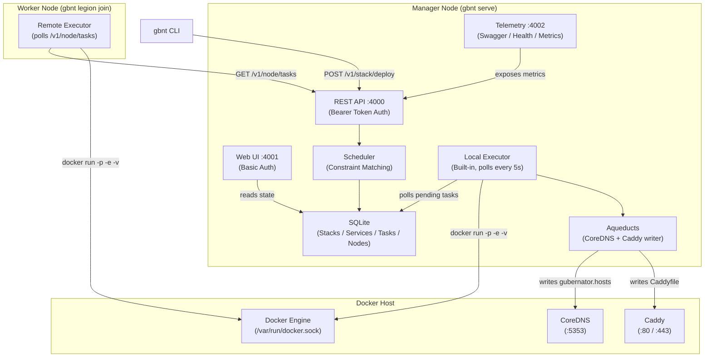

# Architecture

## Overview

Gubernator is an orchestrator designed to offer the **simplicity of Docker Swarm** with the **flexibility of Nomad**. It uses a centralized manager pattern with resilient edge workers and a **built-in local executor** that allows a single node to run a complete cluster.

---

## Component Map



---

## Port Architecture

| Port | Service | Authentication | Purpose |
|------|---------|----------------|---------|
| `:4000` | REST API | `Authorization: Bearer <GBNT_API_TOKEN>` | All CLI and management operations |
| `:4001` | Web UI | HTTP Basic Auth | Dashboard, compose editor, lifecycle management |
| `:4002` | Telemetry | Public (internal use) | Prometheus metrics, Swagger, `/health` |

> **Security model**: Ports 4000 and 4001 are secured. Port 4002 is intentionally public for internal monitoring scraping but should be firewalled from external traffic.

---

## Core Components

### 1. Manager (The Senate)

- Exposes the secured REST API (`:4000`) for CLI and SDK communication
- Hosts the **Flutter Web Dashboard** (`:4001`) for visual cluster management
- Maintains global cluster state using **SQLite** (via GORM)
- Runs the **Scheduler** to match service constraints against node labels
- Runs the **Local Executor** to run containers directly without needing a separate worker

### 2. Worker (The Centurions)

- The same `gbnt` binary in worker mode (`legion join`)
- Polls the Manager API every 5s for pending tasks assigned to its node ID
- Communicates with its **local Docker Engine** to pull images and start containers
- Reports container IP and status back to the Manager
- Sends heartbeats every 10s to keep its `status=active` in the DB

### 3. Local Executor (New in v1.3.27)

The built-in executor runs **inside the Manager process**, enabling true single-node deployments:

```
Manager starts → goroutine launched
  every 5s:
    SELECT tasks WHERE node_id='node-local-manager' AND status='pending'
    → docker pull <image>
    → docker run -d -p <ports> -e <env> -v <volumes> <image>
    → UPDATE task SET status='running', container_ip=..., container_name=...
    → regenerate CoreDNS hosts + Caddyfile
```

### 4. Ingress & DNS (The Aqueducts)

As containers start (via either executor), Gubernator writes two files:

| File | Used by | Format |
|------|---------|--------|
| `gubernator.hosts` | CoreDNS `hosts` plugin | `<IP>  <service>.<stack>.gbnt` |
| `Caddyfile` | Caddy | Reverse-proxy rules from `ingress.host` labels |

> **Transparent DNS Injection:** The Gubernator Executor automatically injects the `--dns <CoreDNS_IP>` flag into every container it launches. This means that all containers natively resolve `*.gbnt` domains and use CoreDNS for external resolution without requiring any manual `dns:` configuration in your `docker-compose.yml` files.

> **Note on External DNS:** CoreDNS can resolve external internet requests by forwarding them. You can configure this via the Web UI (CoreDNS tab) or by setting the `GBNT_DNS_FORWARDERS` environment variable to a space-separated list of IP addresses (e.g., `"8.8.8.8 4.4.4.4"`).

### 5. Observability (The Watchtowers)

Port 4002 exposes:
- `GET /metrics` — Prometheus-format metrics (nodes, tasks, memory)
- `GET /health` — JSON health check (`{"status":"healthy"}`)
- `GET /swagger/index.html` — Interactive Swagger API explorer

### 6. SRE Monitor Stack (`gbnt monitor init`)

A built-in, one-command SRE monitoring deployment that creates a dedicated Docker network (`gbnt-monitor-net`) and launches:

| Container | Image | Port | Purpose |
|-----------|-------|------|---------|
| `gbnt-monitor-cadvisor` | `gcr.io/cadvisor/cadvisor` | `:8081` | Container resource metrics |
| `gbnt-monitor-node-exporter` | `prom/node-exporter` | `:9100` | Host system metrics (CPU, RAM, Disk, Network) |
| `gbnt-monitor-prometheus` | `prom/prometheus` | `:9090` | Metrics collection & scraping |
| `gbnt-monitor-grafana` | `grafana/grafana` | `:3000` | Dashboards (Prometheus + Loki datasources pre-configured) |
| `gbnt-monitor-loki` | `grafana/loki` | `:3100` | Log aggregation |
| `gbnt-monitor-promtail` | `grafana/promtail` | — | Log shipping (Docker + system logs → Loki) |
| `gbnt-monitor-jaeger` | `jaegertracing/all-in-one` | `:4317`, `:4318`, `:16686` | Distributed tracing (OTLP gRPC/HTTP + UI `/jaeger/`) |

```
Data Flow:
  cAdvisor ──metrics──→ Prometheus ──→ Grafana
  Node Exporter ──metrics──→ Prometheus ──→ Grafana
  Gubernator :4002 ──metrics──→ Prometheus ──→ Grafana
  Promtail ──logs──→ Loki ──→ Grafana
  Apps ──traces (OTLP :4317/:4318)──→ Jaeger (:16686 / /jaeger/)
```

Config files are auto-generated in `~/.gbnt/monitor/` and can be customized.

---

## Data Model

```
Nodes
  ├── ID, IP, Role (manager|worker), Status (active|down|drain)
  └── Labels (JSON) — e.g. {"gbnt.node.gpu": "nvidia"}

Stacks
  ├── ID, Name
  └── RawComposeFile (full YAML stored for edit/redeploy)

Services
  ├── ID, StackID, Name, Image
  ├── DesiredReplicas
  ├── Ports, Env, Volumes, Command  ← passed directly to docker run
  └── Constraints (JSON array)

Tasks
  ├── ID, ServiceID, NodeID
  ├── Status (pending|starting|running|dead)
  ├── ContainerName  ← used for docker stop / docker rm
  └── ContainerIP
```

---

## Deployment Workflow

```
1. CLI: gbnt stack deploy -c compose.yml
           ↓
2. API:  POST /v1/stack/deploy (with Bearer token)
           ↓
3. Parse YAML → extract services (image, ports, env, volumes, replicas, constraints)
           ↓
4. Store: Stack → Services → scheduleService()
           ↓
5. Scheduler: match constraints against active nodes → create Tasks (status=pending)
           ↓
6. Executor (local or remote worker):
   a. docker pull <image>
   b. docker run -d --name gbnt-<taskID> -p ... -e ... -v ... <image> [command]
   c. POST /v1/node/tasks/<taskID>/status {status:running, container_ip:..., container_name:...}
           ↓
7. Aqueducts: write gubernator.hosts + Caddyfile
           ↓
8. Done: container running, DNS resolvable, Ingress active
```

---

## Security Model

```
┌─────────────────────────────────────────────────────────┐
│  Port 4000 — API                                        │
│  Middleware: Authorization: Bearer <GBNT_API_TOKEN>     │
│  Default token: "admin" (change in production!)         │
└─────────────────────────────────────────────────────────┘
┌─────────────────────────────────────────────────────────┐
│  Port 4001 — Web UI                                     │
│  Middleware: HTTP Basic Auth                            │
│  Credentials: GBNT_WEB_USER / GBNT_WEB_PASSWORD        │
└─────────────────────────────────────────────────────────┘
┌─────────────────────────────────────────────────────────┐
│  Port 4002 — Telemetry                                  │
│  No authentication (intended for internal scraping)     │
│  Firewall recommended for production                    │
└─────────────────────────────────────────────────────────┘
```
