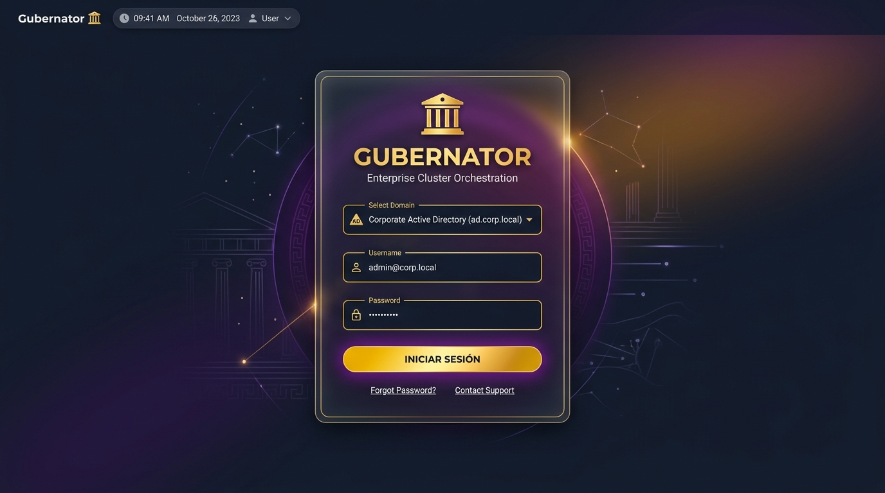
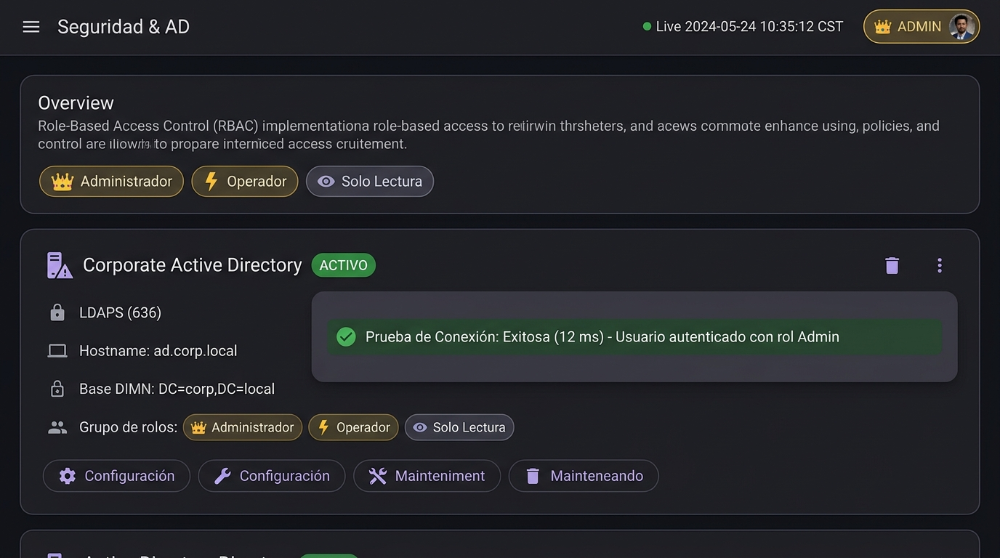

# 🛡️ Enterprise Active Directory, LDAP & RBAC

Gubernator provides enterprise-grade identity federation and Role-Based Access Control (RBAC), enabling organization-wide single sign-on (SSO) with **Microsoft Active Directory** and **OpenLDAP**, alongside an emergency **Local Administrator** fallback.

---

## 📸 Visual Showcase

### Modern Login Screen & Domain Selector


### Security & Active Directory Management Dashboard


---

## 🏛 Architecture & Security Model

```
 ┌────────────────────────────────────────────────────────┐
 │                   GUBERNATOR WEB UI                    │
 │   - Modern Login Screen with Domain / AD Selector      │
 │   - Profile & Role Badge: 👑 Admin | ⚡ Ops | 👁️ View │
 └──────────────────────────┬─────────────────────────────┘
                            │ (REST /api/auth/login)
                            ▼
 ┌────────────────────────────────────────────────────────┐
 │             GUBERNATOR CORE AUTH ENGINE                │
 │  - Local Emergency Admin (admin / admin fallback)      │
 │  - Multi-Server Active Directory / OpenLDAP Dialers    │
 │  - LDAPS (Port 636) & StartTLS (Port 389) Handshake    │
 │  - Dynamic Group DN -> RBAC Role Resolution            │
 │  - Cryptographic HMAC-SHA256 JWT Token Signing         │
 └─────────────┬────────────────────────────┬─────────────┘
               │                            │
               ▼                            ▼
 ┌───────────────────────────┐ ┌──────────────────────────┐
 │  Primary Active Directory │ │ Secondary LDAP Server    │
 │   dc1.corporate.local     │ │   dc2.dr-site.local      │
 └───────────────────────────┘ └──────────────────────────┘
```

---

## 👥 Role-Based Access Control (RBAC) Matrix

| Capability | 👑 Admin | ⚡ Operator | 👁️ Read-Only |
| :--- | :---: | :---: | :---: |
| **Overview Dashboard & Telemetry** | ✅ Full | ✅ Full | ✅ Full |
| **Deploy Stacks (`docker-compose.yml`)** | ✅ Full | ✅ Full | ❌ Restricted |
| **Redeploy & Duplicate Stacks** | ✅ Full | ✅ Full | ❌ Restricted |
| **Delete Stacks** | ✅ Full | ❌ Restricted | ❌ Restricted |
| **Task Lifecycle (Start / Stop / Restart)** | ✅ Full | ✅ Full | ❌ Restricted |
| **Container & Node Terminal Shell** | ✅ Full | ✅ Full | ❌ Restricted |
| **Centurions Management (Drain / Activate / Leave)** | ✅ Full | ❌ Restricted | ❌ Restricted |
| **Caddy TLS Lifecycle & Certificate Upload** | ✅ Full | ❌ Restricted | ❌ Restricted |
| **CoreDNS Forwarders & Custom Records** | ✅ Full | ❌ Restricted | ❌ Restricted |
| **Active Directory & LDAP Directory Settings** | ✅ Full | ❌ Restricted | ❌ Restricted |
| **Grafana, Jaeger & Weave Scope Dashboards** | ✅ Full | ✅ Full | ✅ Full |

---

## ⚙️ Active Directory Configuration Guide

### 1. Web UI Configuration
Navigate to **Seguridad & AD** in the sidebar:
1. Click **Añadir Servidor AD / LDAP**.
2. Configure your server parameters:
   - **Nombre Descriptivo:** `Corporate Active Directory`
   - **Host / Puerto:** `dc1.empresa.local` : `636` (LDAPS / TLS) o `389` (StartTLS).
   - **Base DN (Search Base):** `DC=empresa,DC=local`.
   - **Service Account Bind DN:** `CN=svc_gubernator,OU=ServiceAccounts,DC=empresa,DC=local`.
   - **Bind Password:** `••••••••`.
   - **User Filter:** `(&(objectClass=user)(sAMAccountName=%s))`.
   - **Mapeo de Grupos a Roles RBAC:**
     - 👑 **Admin Group:** `CN=Gubernator_Admins,OU=Groups,DC=empresa,DC=local`
     - ⚡ **Operator Group:** `CN=Gubernator_Operators,OU=Groups,DC=empresa,DC=local`
     - 👁️ **Read-Only Group:** `CN=Gubernator_Viewers,OU=Groups,DC=empresa,DC=local`
     - **Default Role:** `readonly` (asignado si el usuario no pertenece a ningún grupo específico).
3. Click **Test Connection** para validar la conectividad TCP, negociación TLS, autenticación del Bind y resolución de atributos de usuario y grupos en tiempo real.
4. Click **Guardar**.

---

## 🔌 REST API Specification

### 1. List Auth Providers
```http
GET /api/auth/providers
```
Response:
```json
{
  "providers": [
    {"id": "local", "name": "Local Administrator", "type": "local"},
    {"id": "ad-corp-primary", "name": "Corporate Active Directory", "type": "ldap"}
  ]
}
```

### 2. User Authentication (Login)
```http
POST /api/auth/login
Content-Type: application/json

{
  "username": "mario.ezquerro",
  "password": "CorporatePassword123!",
  "provider": "ad-corp-primary"
}
```
Response:
```json
{
  "token": "eyJhbGciOiJIUzI1NiIsIn...",
  "user": {
    "username": "mario.ezquerro",
    "display_name": "Mario Ezquerro",
    "email": "mario.ezquerro@empresa.local",
    "role": "admin",
    "provider": "ldap:ad-corp-primary",
    "permissions": {
      "can_deploy_stacks": true,
      "can_delete_stacks": true,
      "can_restart_tasks": true,
      "can_delete_tasks": true,
      "can_execute_shell": true,
      "can_manage_nodes": true,
      "can_manage_caddy": true,
      "can_manage_coredns": true,
      "can_manage_security": true,
      "can_view_observability": true
    },
    "expires_at": "2026-08-18T08:00:00Z"
  }
}
```

### 3. Verify Active Session
```http
GET /api/auth/me
Authorization: Bearer <jwt-token>
```

### 4. LDAP Configuration Management (`admin` only)
- `GET /api/auth/ldap`: List configured LDAP servers (passwords masked as `••••••••`).
- `POST /api/auth/ldap`: Create or update LDAP configuration.
- `DELETE /api/auth/ldap/:id`: Remove LDAP directory connection.
- `POST /api/auth/ldap/test`: Live connection test and diagnostic analyzer.

---

## 🔒 Emergency Local Administrator Access

If the Active Directory domain controllers are offline or during disaster recovery, Gubernator always maintains an emergency local administrator account configured via environment variables:

```bash
export GBNT_WEB_USER="admin"
export GBNT_WEB_PASSWORD="YourStrongLocalPassword"
```

In the login screen, choose **Local Administrator** (or click *"Acceso Rápido Local"*) to authenticate immediately without LDAP dependencies.
