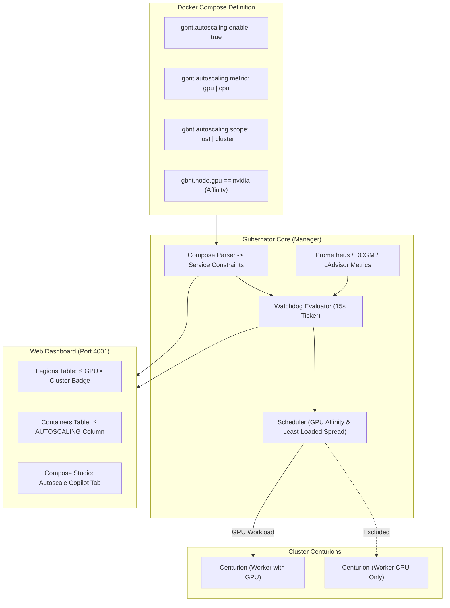

# Declarative Autoscaling Subsystem & Hardware Affinity

Gubernator features a native **Declarative Horizontal Autoscaling Subsystem** that automatically adjusts container replica counts based on real-time resource utilization. Configured entirely via standard Docker Compose labels (`gbnt.autoscaling.*`), it supports **GPU and CPU metrics**, strictly enforces **hardware affinity (e.g. NVIDIA GPUs)**, and respects **single-host vs. multi-host stack placement constraints**.

---

## 🏛 Architecture Overview

Gubernator's autoscaler operates on a **15-second evaluation loop** integrated directly into the cluster's self-healing watchdog engine on the Manager host:



1. **Passive & Non-Intrusive:** If `gbnt.autoscaling.enable` is omitted or `false`, autoscaling is completely disabled and services operate with static `desired_replicas`.
2. **Real-Time Telemetry:** Metrics are gathered directly from Prometheus (`container_gpu_utilization`, `DCGM_FI_DEV_GPU_UTIL`, or `container_cpu_usage_seconds_total`) with automated fallbacks to local Docker engine telemetry.
3. **Hardware Affinity Filter:** The scheduler inspects the Centurions' detected hardware (`docker.NodeHasGPU`). GPU-scaled services in cluster mode will **never** be scheduled onto CPU-only nodes.
4. **Single-Host Containment:** Services pinned to a single host (`gbnt.placement.strategy: single-host` or `node.hostname == ...`) are strictly constrained to that node, ensuring atomic stack cohesion.

---

## 📋 Declarative Compose Labels Reference

All autoscaling settings are declared under `services.<service>.labels` or `services.<service>.deploy.labels`:

| Label | Supported Values | Default | Description |
| :--- | :--- | :--- | :--- |
| `gbnt.autoscaling.enable` | `"true"`, `"false"`, `"1"`, `"0"` | `"false"` | Master switch. When omitted or `false`, autoscaling is disabled. |
| `gbnt.autoscaling.metric` | `"gpu"`, `"cpu"` | `"cpu"` | Resource metric to monitor. |
| `gbnt.autoscaling.scope` | `"host"`, `"cluster"` | `"host"` | **`host`**: Scale only on the current node.<br>**`cluster`**: Scale across all eligible cluster nodes. |
| `gbnt.autoscaling.target` | `10` – `100` | `80` (80%) | Target utilization percentage threshold. |
| `gbnt.autoscaling.min` | Integer $\ge 1$ | `1` | Minimum replica count floor (never scales below this). |
| `gbnt.autoscaling.max` | Integer $\ge 1$ | `5` | Maximum replica count ceiling (never scales above this). |
| `gbnt.autoscaling.cooldown` | Duration (`"30s"`, `"60s"`, `"2m"`) | `"60s"` | Minimum elapsed time between consecutive scale events. |

---

## ⚡ Hardware & Placement Affinity Rules

Gubernator's scheduler enforces strict affinity rules during horizontal scaling:

### 1. GPU Hardware Affinity
* When `gbnt.autoscaling.metric: gpu` or `gbnt.node.gpu == nvidia` is set:
  * In `cluster` mode, the scheduler queries each active node for NVIDIA GPU drivers and runtime support (`docker.NodeHasGPU()`).
  * **Strict Exclusion:** Nodes without GPU hardware are **completely excluded** from scale-out placement.
  * If only one GPU node exists in the cluster, additional replicas scale on that node up to `gbnt.autoscaling.max`.

### 2. Single-Host vs. Multi-Host Placement Affinity
* **Single-Host Pinned Stacks:** If a stack or service specifies:
  * `gbnt.placement.strategy: single-host`
  * `deploy.placement.constraints: ["node.hostname == gbnt-worker1"]`
  * Or was scheduled atomically to a single host (`stack.NodeID != "multi-host"` without spread directives)
  * **Rule:** The autoscaler automatically overrides the scope to **`host`** (`SingleHostOnly = true`). Replicas will **only scale on that specific host**, preventing distributed placement violations.
* **Distributed Multi-Host Stacks:** If a service specifies `gbnt.placement.strategy: spread` or `deploy.placement.preferences: - spread: node.id`, the autoscaler defaults to **`cluster`** scope and distributes new replicas across eligible Centurions using Least-Loaded Spread.

---

## 🖥 Web Dashboard Experience (Flutter)

### Interactive Autoscale Control Dialog
Clicking on the **`AUTOSCALE`** chip in either the Legions table or Containers table (or selecting **Autoscale Settings** from the row actions menu) immediately opens the **Horizontal Autoscaling Controls** dialog:

* **Master Status Switch:** Toggle autoscaling ON or OFF in 1 click.
* **1. Scaling Metric:** Select between **GPU (NVIDIA / CUDA)** (highlighted in purple with AI/ML acceleration badge and hardware affinity auto-binding) or **CPU Utilization** (cyan badge for general compute).
* **2. Scaling Scope & Affinity:** Choose **Single Host (Local)** (keeps all instances on the same host) or **All Centurions (Cluster)** (spreads instances across nodes with GPU verification).
* **3. Target Utilization Threshold:** Interactive slider from 10% to 100% (default 80%).
* **4. Replica Boundaries & Cooldown:** Adjust Min Replicas (minimum 1), Max Replicas (up to 50), and Cooldown period (`30s`, `60s`, `2m`, `5m`).
* **Instant Application:** Clicking **Save & Apply Autoscale** updates SQLite persistence and cluster watchdog immediately without requiring container redeployment.

### Legions (Stacks) DataTable
The Legions dashboard view renders a dedicated **`AUTOSCALE`** column:

* ⚡ **GPU • Cluster** (Purple/Amber Badge with GPU chip icon `Icons.developer_board`): Indicates GPU utilization autoscaling across GPU-enabled Centurions. Clickable to edit.
* ⚡ **CPU • Host** (Cyan/Blue Badge with speedometer icon `Icons.speed`): Indicates CPU utilization autoscaling on the local host. Clickable to edit.
* ⚡ **Off** (Subtle Gray Badge): Indicates manual static replica management. Clickable to configure and enable autoscaling.
* **Rich Tooltip:** Hovering over any badge displays target %, scope, boundaries, and affinity constraints.

### Containers (Tasks) PlutoGrid
The Containers table includes an **`AUTOSCALE`** column next to each container instance:
* Both active chips and `Off` chips are interactive (`InkWell`), allowing operators to configure autoscaling directly for the underlying workload.
* The container context menu (3 vertical dots) includes an **Autoscale Settings** action with lightning bolt icon.

### Compose Studio & Gubernator Copilot
* **Autoscale Copilot Tab:** A dedicated wizard tab in the Compose Studio sidebar (`_activeCopilotTab == 'autoscale'`) providing 1-click production blueprints:
  * ⚡ **GPU AI/Inference Cluster Autoscale** (80% GPU, Cluster, Min 1, Max 4, NVIDIA affinity).
  * 🚀 **CPU High-Load Web Autoscale** (75% CPU, Cluster, Min 2, Max 8).
  * 💻 **Single-Host CPU Autoscale** (85% CPU, Local Host, Min 1, Max 3).
* **Smart Autocomplete:** Inserting `gbnt.autoscaling.*` chips automatically injects correctly indented YAML snippets into the active compose buffer.

---

## 🔌 REST API Endpoints

| Method | Endpoint | Access | Description |
| :--- | :--- | :--- | :--- |
| `GET` | `/api/autoscaling/policies` | Read-only | Returns all active cluster services with their parsed autoscaling policies and affinity constraints. |
| `GET` | `/api/autoscaling/events` | Read-only | Returns audit history of recent horizontal scale-up and scale-down events. |
| `POST` | `/api/services/:id/autoscale` | Admin / Operator | Updates horizontal autoscaling configuration for a specific service. |
| `POST` | `/api/stack/:id/autoscale` | Admin / Operator | Updates horizontal autoscaling configuration for all services of a stack. |
| `POST` | `/api/services/:id/scale` | Admin / Operator | Manual replica scale override (`{"replicas": 3}`). |

### Example Policy Response (`GET /api/autoscaling/policies`)
```json
[
  {
    "service_id": "250f33cd-3aa3-4a9a-81d7-f5964a931dee",
    "service_name": "echo-ai",
    "stack_id": "aee34fa9-a2cf-4948-94bb-62d6fbb1c782",
    "policy": {
      "enabled": true,
      "scope": "cluster",
      "metric": "gpu",
      "target": 80,
      "min": 1,
      "max": 4,
      "cooldown": 60000000000,
      "pinned_host": "",
      "single_host_only": false
    }
  }
]
```

---

## 🚀 Production Compose Examples

### 1. GPU AI / LLM Inference Cluster Stack
Scales horizontally across Centurion nodes equipped with NVIDIA GPUs when GPU utilization exceeds 80%:

```yaml
version: '3.8'

services:
  vllm-inference:
    image: vllm/vllm-openai:latest
    ports:
      - "8000:8000"
    labels:
      - "ingress.host=llm.gbnt.local"
      - "gbnt.caddy.port=8000"
      - "gbnt.caddy.lb=round_robin"
      - "gbnt.placement.strategy=spread"
      - "gbnt.autoscaling.enable=true"
      - "gbnt.autoscaling.metric=gpu"
      - "gbnt.autoscaling.scope=cluster"
      - "gbnt.autoscaling.target=80"
      - "gbnt.autoscaling.min=1"
      - "gbnt.autoscaling.max=4"
      - "gbnt.autoscaling.cooldown=60s"
    deploy:
      replicas: 1
      placement:
        constraints:
          - "gbnt.node.gpu == nvidia"
```

### 2. High-Throughput Web Backend (Multi-Host CPU)
Distributes web replicas across worker nodes, scaling up to 8 instances when CPU load exceeds 75%:

```yaml
version: '3.8'

services:
  web-api:
    image: my-company/api:v2.4
    ports:
      - "8080:8080"
    labels:
      - "ingress.host=api.company.com"
      - "gbnt.caddy.port=8080"
      - "gbnt.caddy.lb=least_conn"
      - "gbnt.placement.strategy=spread"
      - "gbnt.autoscaling.enable=true"
      - "gbnt.autoscaling.metric=cpu"
      - "gbnt.autoscaling.scope=cluster"
      - "gbnt.autoscaling.target=75"
      - "gbnt.autoscaling.min=2"
      - "gbnt.autoscaling.max=8"
      - "gbnt.autoscaling.cooldown=45s"
    deploy:
      replicas: 2
```

### 3. Single-Host Isolated Worker
Pinned to `gbnt-worker1` with single-host containment:

```yaml
version: '3.8'

services:
  batch-processor:
    image: python:3.11-slim
    command: python worker.py
    labels:
      - "gbnt.placement.strategy=single-host"
      - "gbnt.autoscaling.enable=true"
      - "gbnt.autoscaling.metric=cpu"
      - "gbnt.autoscaling.scope=host"
      - "gbnt.autoscaling.target=85"
      - "gbnt.autoscaling.min=1"
      - "gbnt.autoscaling.max=3"
    deploy:
      replicas: 1
      placement:
        constraints:
          - "node.hostname == gbnt-worker1"
```
