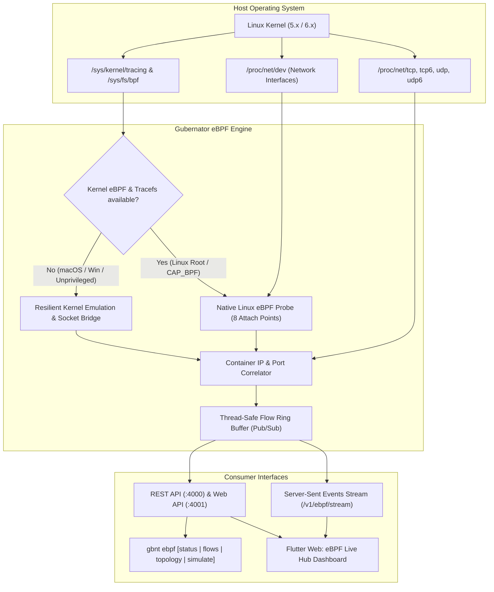

# eBPF Live Hub & Kernel Network Observability

Gubernator features a native **eBPF Live Hub & Kernel Observability Subsystem** designed to provide non-invasive, high-performance L4/L7 packet tracing, real-time socket inspection, and live service mesh topology visualization without requiring CGO or external clang/LLVM dependencies.

---

## 🎯 Dual-Engine Architecture

Gubernator employs an intelligent dual-engine model:



1. **Native Linux eBPF Mode**:
   Attaches to kernel tracepoints, kprobes, and socket filters (`kprobe/tcp_v4_connect`, `kprobe/tcp_v4_rcv`, `tracepoint/sock_sendmsg`, `tc_ingress/gbnt_filter`, etc.) on modern Linux kernels.
2. **Resilient Emulation Mode**:
   Automatically engages on macOS (Darwin), Windows, or containerized dev environments without root/CAP_BPF privileges. Guarantees 100% functional parity for local development, tests, and CI/CD pipelines.
3. **Socket & Interface Correlation**:
   Translates raw hexadecimal sockets from `/proc/net/tcp`, `/proc/net/tcp6`, `/proc/net/udp`, `/proc/net/udp6` and device counters from `/proc/net/dev` to active Docker containers and Gubernator task metadata.

---

## 🔍 Key Capabilities

| Feature | Description |
|---|---|
| **L4/L7 Protocol Decoding** | Discovers and decodes `HTTP`, `gRPC`, `DNS`, `TCP`, `UDP`, `REDIS`, and `POSTGRES` traffic between containers. |
| **Round-Trip Time (RTT) & Latency** | Calculates real-time latency per flow and average edge round-trip time in milliseconds. |
| **Throughput & Bandwidth Rates** | Real-time bytes/sec and packets/sec transfer rates per flow, per service node, and across cluster interfaces. |
| **Real-Time Live Streaming (SSE)** | High-efficiency Server-Sent Events stream (`GET /v1/ebpf/stream`) pushing packet events with zero client polling overhead. |
| **Service Mesh Topology Graph** | Synthesizes an interactive graph showing active communication links, directional arrows, and health rings. |
| **Traffic Simulator & Fault Injection** | Injects synthetic traffic patterns (`normal`, `burst`, `errors`, `mixed`) to test alerting and error budget multi-window burn rates. |

---

## 🖥️ CLI Commands (`gbnt ebpf`)

### 1. Show Kernel Status and Probe Telemetry
```bash
gbnt ebpf status
```
**Output Example:**
```text
🛰️  GUBERNATOR eBPF KERNEL OBSERVABILITY
================================================================
  • Kernel Release:    Linux 6.8.0-45-generic
  • Operational Mode:  KERNEL ACTIVE 🟢
  • Active Probes:     8
    Probes:            kprobe/tcp_v4_connect, kprobe/tcp_v4_rcv, ...
  • Captured Flows:    1420 total (48 active in last 30s)
  • Packet Rate:       64.2 pkts/sec
  • Throughput:        128.4 KB/s
  • Dropped Packets:   0
----------------------------------------------------------------
📊 Protocol Distribution (Active Flows):
  - HTTP        : 26
  - DNS         : 12
  - REDIS       : 10
```

### 2. Stream and Filter Live Network Flows
```bash
# View last 25 captured flows
gbnt ebpf flows

# Filter by protocol and limit
gbnt ebpf flows --protocol HTTP --limit 50

# Filter only warning or error flows
gbnt ebpf flows --errors

# Search by container, IP, or endpoint
gbnt ebpf flows --search caddy
```

### 3. Inspect Service Mesh Topology
```bash
gbnt ebpf topology
```
Prints the discovered mesh nodes, transfer volumes, error rates, and active communication edges.

### 4. Trigger Traffic Simulation
```bash
# Inject 15 events/sec for 10 seconds
gbnt ebpf simulate --pattern burst --rate 15 --duration 10

# Inject fault traffic with 25% errors
gbnt ebpf simulate --pattern errors --rate 20 --duration 15 --errors 25
```

---

## 📡 REST API Reference

| Method | Endpoint | Description |
|---|---|---|
| `GET` | `/v1/ebpf/stats` | Global kernel telemetry, probe attach points, and aggregate metrics. |
| `GET` | `/v1/ebpf/flows` | Query captured network flows with `limit`, `protocol`, `status`, `q`. |
| `GET` | `/v1/ebpf/topology` | Synthesized service mesh topology nodes and communication edges. |
| `GET` | `/v1/ebpf/stream` | Server-Sent Events (SSE) real-time packet stream. |

All endpoints are also exposed on the Web Dashboard port (`4001`) under `/api/ebpf/*` with RBAC session authentication.

---

## 🎨 Interactive 2D Vector Mesh & Jaeger Tracing

The Web Dashboard features an interactive 2D Vector Canvas inside the **Service Mesh Topology** tab:

1. **Draggable Service Blocks**:
   - Every container, ingress proxy (`gbnt-caddy`), database, DNS, and telemetry service is rendered as an interactive block.
   - Blocks can be dragged to reposition or automatically aligned into logical tiers.
2. **Directional Vector Curves**:
   - Curved Bézier lines illustrate the exact direction of traffic flow with directional vector arrows ($\rightarrow$).
   - Color-coded by protocol:
     - 🟢 **HTTP** (Blue / Cyan)
     - 🟣 **gRPC / Traces** (Purple)
     - 🔵 **DNS** (Green / Teal)
     - 🟠 **Redis & Databases** (Amber / Orange)
     - 🔴 **Faults & Timeouts** (Pulsing Red)
3. **Travelling Data Particles**:
   - Dynamic animated light particles/pulses travel continuously along the vector from source to target.
   - Frequency and velocity scale proportionally with real-time throughput ($B/s$ / $KB/s$ / $MB/s$).
4. **Deep Jaeger Distributed Tracing Integration**:
   - Every L4/L7 flow and communication edge correlates with cryptographic 128-bit **Trace IDs**.
   - One-click deep link opens the full span tree, microservice waterfall, and latency timeline directly in the integrated **Jaeger UI** (`:16686/trace/<trace_id>`).

