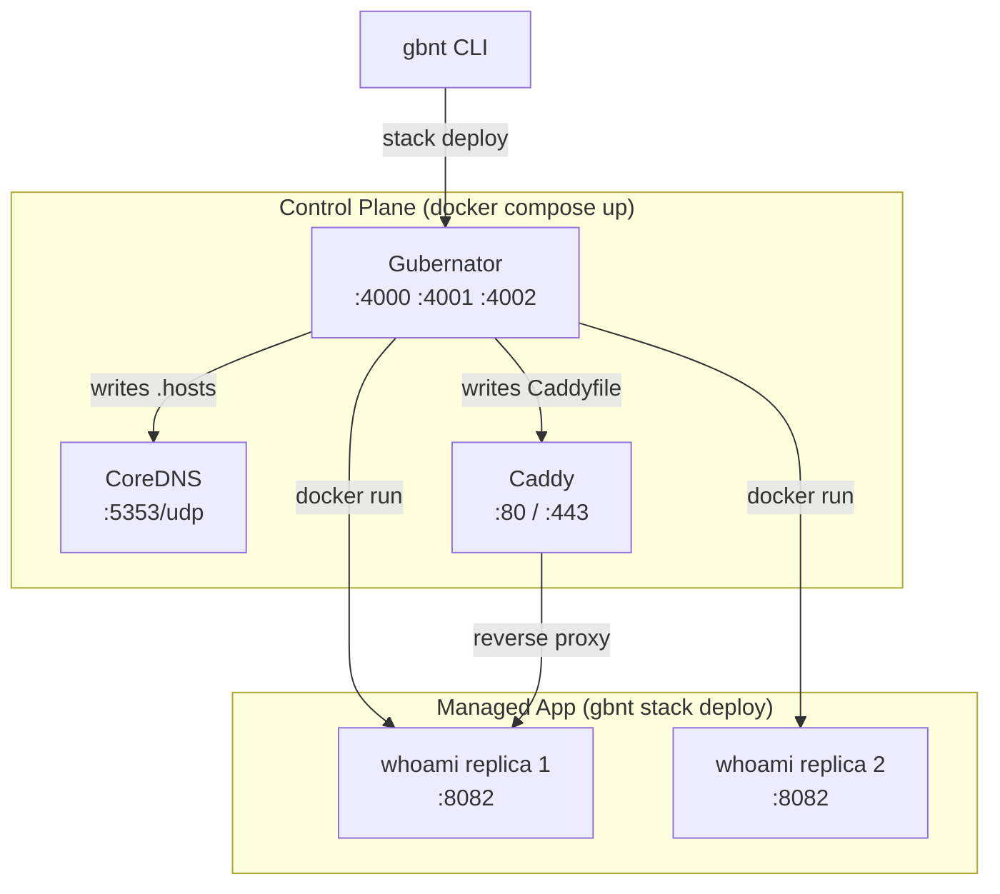

# The Empire — Gubernator + CoreDNS + Caddy

This example demonstrates the **"Empire Trifecta"**: a full cluster control plane combining Gubernator with CoreDNS (DNS resolution) and Caddy (Ingress/Reverse Proxy), plus a managed application deployed and orchestrated by Gubernator.

---

## Architecture



---

## Prerequisites

- Docker and Docker Compose
- `gbnt` binary compiled:
  ```bash
  go build -o gbnt ./cmd/gbnt
  ```

---

## Step 1: Launch the Control Plane

Open a terminal inside `examples/the-empire/`:

```bash
cd examples/the-empire
docker compose up -d
```

| Container | Ports | Description |
|-----------|-------|-------------|
| `gubernator-manager` | 4000 / 4001 / 4002 | Orchestrator |
| `coredns` | 5353/udp | Internal DNS |
| `caddy` | 80 / 443 | Ingress |

Verify the control plane is healthy:
```bash
curl http://localhost:4002/health
# → {"status":"healthy"}
```

Open the dashboard: [http://localhost:4001](http://localhost:4001) (admin/admin)

---

## Step 2: Get the Join Token

The Manager is running inside Docker. Retrieve its join token:

```bash
curl -s -H "Authorization: Bearer admin" \
  http://localhost:4000/v1/cluster/token
```

Copy the `token` value.

---

## Step 3: Join a Local Worker

From the **repository root**, start a worker that executes containers on your local Docker daemon:

```bash
export GBNT_API_TOKEN=admin
./gbnt legion join --token <YOUR_TOKEN> --manager localhost:4000
```

Leave this terminal running (polls for tasks every 5s).

---

## Step 4: Deploy the Test Application

```bash
export GBNT_API_TOKEN=admin
./gbnt stack deploy -c examples/the-empire/test-app.yml myapp
```

This deploys **2 replicas** of `traefik/whoami` exposed on port **8082**.

---

## Step 5: Verify

```bash
# Containers are running
docker ps | grep gbnt

# Hit the application
curl http://localhost:8082
# → Hostname, IP, headers from whoami

# Check DNS resolution
dig @localhost -p 5353 whoami.myapp.gbnt +short
# → Internal container IP

# List tasks in Gubernator
./gbnt task ls
```

Open [http://localhost:4001](http://localhost:4001) to see both tasks in `running` state.

---

## Step 6: Edit & Redeploy from Web UI

1. Open [http://localhost:4001](http://localhost:4001)
2. Find `myapp` → click **Edit YAML**
3. Change `replicas: 2` to `replicas: 3` (or change the image)
4. Click **Save & Redeploy**

Gubernator stops the existing containers and starts new ones. Watch the task list update live.

---

## Step 7: Clean Up

```bash
export GBNT_API_TOKEN=admin

# Remove the app stack
./gbnt stack rm <stack_id>

# Shut down the control plane
cd examples/the-empire
docker compose down -v
```

---

## Source Files

All files are in [`examples/the-empire/`](https://github.com/mario-ezquerro/gubernator/tree/main/examples/the-empire) in the repository.
