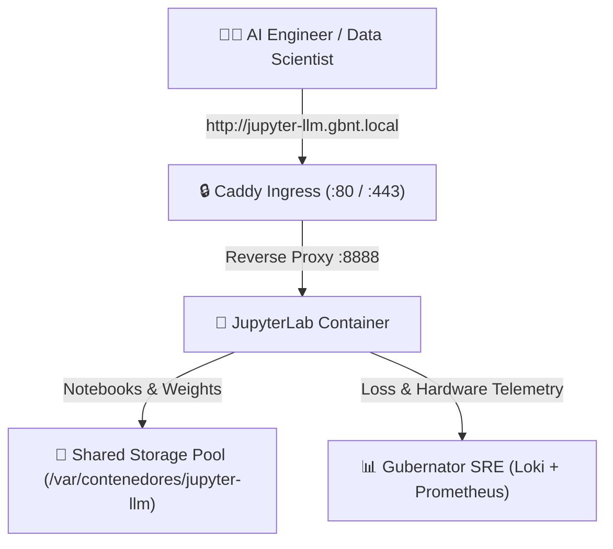

# 🧪 JupyterLab PyTorch LLM Training Lab

Deploy an enterprise **JupyterLab Data Science & AI Workspace** pre-configured with **PyTorch**, **Hugging Face Transformers**, **TRL (SFTTrainer)**, and **PEFT (LoRA/QLoRA)**.

---

## 🏛 Architecture Overview



---

## 🚀 Compose Blueprint

```yaml
version: "3.8"

services:
  jupyter-llm:
    image: quay.io/jupyter/pytorch-notebook:latest
    container_name: jupyter_llm_lab
    restart: unless-stopped
    ports:
      - "127.0.0.1::8888"
    environment:
      - JUPYTER_TOKEN=gubernator-secret
      - JUPYTER_ENABLE_LAB=yes
    volumes:
      - /var/contenedores/jupyter-llm/work:/home/jovyan/work
      - /var/contenedores/jupyter-llm/hf_cache:/home/jovyan/.cache/huggingface
    deploy:
      resources:
        limits:
          memory: 8G
        reservations:
          memory: 2G
      placement:
        constraints:
          - stack.name == jupyter-llm-stack
          - ingress.host == jupyter-llm.gbnt.local
          - gbnt.caddy.port == 8888
          - node.labels.gbnt.node.role == worker
```

---

## 🔬 Interactive Fine-Tuning Steps

1. Connect to `http://jupyter-llm.gbnt.local` with token `gubernator-secret`.
2. Open `llm_lora_finetuning.ipynb`.
3. Follow the 7-step pipeline:
   * **Step 1:** Hardware environment check (`PyTorch`, `CUDA`/`CPU`).
   * **Step 2:** Load ChatML domain instruction dataset.
   * **Step 3:** Initialize base model (`SmolLM-135M` or `Qwen2.5-0.5B`).
   * **Step 4:** Attach LoRA adapter config (`r=8`, `alpha=16`).
   * **Step 5:** Train with `SFTTrainer` with live loss reporting.
   * **Step 6:** Perform comparative inference tests.
   * **Step 7:** Save weights to `/home/jovyan/work/output/`.
