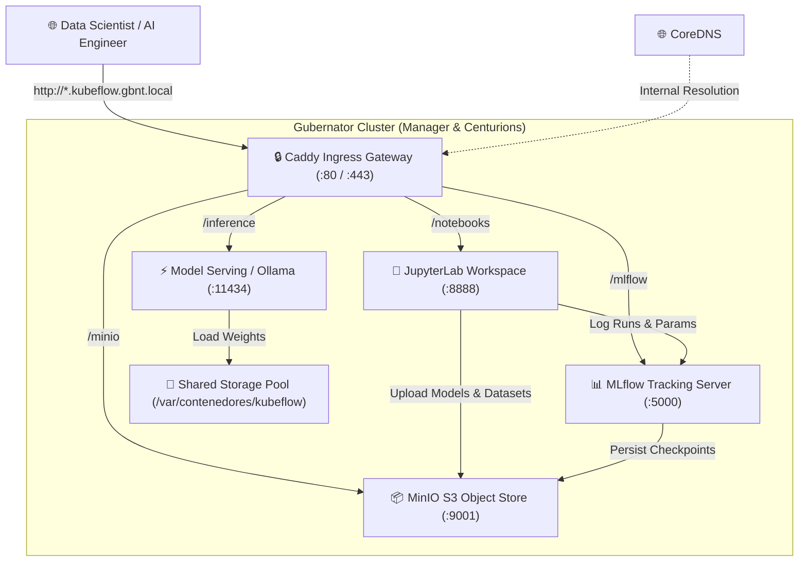

# 🧠 Kubeflow MLOps Platform Suite

Deploy an enterprise-grade, fully containerized **Machine Learning & AI Platform** (Kubeflow / MLOps equivalent) on Gubernator clusters using native Docker Compose.

---

## 🏛 Architecture Overview



---

## ⚖️ Kubernetes Kubeflow vs. Gubernator MLOps

| Feature | Kubernetes Kubeflow (`manifests`) | Gubernator MLOps (`kubeflow-stack`) |
| :--- | :--- | :--- |
| **Control Plane Overhead** | Heavy (`k8s-apiserver`, `etcd`, `Istio`, `Dex`, 30+ CRDs) | **Ultra-Lightweight** (Single Go binary + Caddy Ingress) |
| **RAM Footprint** | 16 GB - 32 GB minimum baseline | **< 2 GB** baseline |
| **Deployment Complexity** | Multi-step `kustomize` / Helm overlays | **1-Click** Deploy from Gubernator Compose Studio |
| **Storage Mobility** | Heavy CSI drivers (Ceph-CSI, Rook) | **Granaries** (`/var/contenedores` NFS/GlusterFS mobility) |
| **Interactive Notebooks** | Jupyter Notebook Controller | Official JupyterLab with PyTorch & CUDA |
| **Experiment Tracking** | Kubeflow Metadata / Katib | **MLflow Tracking Server** + Model Registry |
| **Object / Artifact Store** | MinIO S3 | **MinIO S3** with auto-provisioned buckets |
| **Model Serving** | KServe / vLLM / Triton | **vLLM / Ollama** with OpenAI-compatible API |

---

## 🚀 Compose Blueprint

```yaml
version: "3.8"

services:
  # 1. MinIO S3 Storage (Artifacts & Datasets)
  minio:
    image: minio/minio:latest
    restart: unless-stopped
    command: server /data --console-address ":9001"
    environment:
      - MINIO_ROOT_USER=kubeflow
      - MINIO_ROOT_PASSWORD=gubernator123
    ports:
      - "9000:9000"
      - "9001:9001"
    volumes:
      - /var/contenedores/kubeflow/minio_data:/data
    labels:
      - "ingress.host=minio.kubeflow.gbnt.local"
      - "gbnt.caddy.port=9001"
    deploy:
      resources:
        limits:
          memory: 2G
        reservations:
          memory: 512M

  # 2. MinIO Auto-Bucket Initializer
  minio-init:
    image: minio/mc:latest
    restart: unless-stopped
    entrypoint: >
      /bin/sh -c "
      sleep 4;
      /usr/bin/mc alias set s3 http://127.0.0.1:9000 kubeflow gubernator123;
      /usr/bin/mc mb --ignore-existing s3/mlflow-artifacts;
      /usr/bin/mc mb --ignore-existing s3/datasets;
      /usr/bin/mc mb --ignore-existing s3/checkpoints;
      /usr/bin/mc anonymous set download s3/mlflow-artifacts;
      echo '✅ MinIO MLOps buckets initialized successfully!';
      tail -f /dev/null;
      "

  # 3. MLflow Tracking Server & Model Registry
  mlflow:
    image: ghcr.io/mlflow/mlflow:latest
    restart: unless-stopped
    command: >
      mlflow server
      --host 0.0.0.0
      --port 5000
      --workers 1
      --allowed-hosts "*"
      --backend-store-uri sqlite:////data/mlflow.db
      --default-artifact-root s3://mlflow-artifacts/
    environment:
      - AWS_ACCESS_KEY_ID=kubeflow
      - AWS_SECRET_ACCESS_KEY=gubernator123
      - MLFLOW_S3_ENDPOINT_URL=http://minio.kubeflow.gbnt.local
      - MLFLOW_S3_IGNORE_TLS=true
      - MLFLOW_ALLOWED_HOSTS=*
    ports:
      - "5000:5000"
    volumes:
      - /var/contenedores/kubeflow/mlflow_data:/data
    labels:
      - "ingress.host=mlflow.kubeflow.gbnt.local"
      - "gbnt.caddy.port=5000"
      - "gbnt.service.name=mlflow-tracking"
    deploy:
      resources:
        limits:
          memory: 4G
        reservations:
          memory: 1G

  # 4. Interactive JupyterLab & PyTorch Workspaces
  jupyter-workspace:
    image: quay.io/jupyter/pytorch-notebook:latest
    restart: unless-stopped
    environment:
      - JUPYTER_TOKEN=gubernator-secret
      - JUPYTER_ENABLE_LAB=yes
      - AWS_ACCESS_KEY_ID=kubeflow
      - AWS_SECRET_ACCESS_KEY=gubernator123
      - MLFLOW_TRACKING_URI=http://mlflow.kubeflow.gbnt.local
      - MLFLOW_S3_ENDPOINT_URL=http://minio.kubeflow.gbnt.local
    ports:
      - "8888:8888"
    volumes:
      - /var/contenedores/kubeflow/workspaces:/home/jovyan/work
      - /var/contenedores/kubeflow/cache:/home/jovyan/.cache
    labels:
      - "ingress.host=notebooks.kubeflow.gbnt.local"
      - "gbnt.caddy.port=8888"
      - "gbnt.service.name=jupyterlab"
    deploy:
      resources:
        limits:
          memory: 6G
        reservations:
          memory: 1G

  # 5. Model Serving & Inference Gateway
  inference-engine:
    image: ollama/ollama:latest
    restart: unless-stopped
    ports:
      - "11434:11434"
    volumes:
      - /var/contenedores/kubeflow/models:/root/.ollama
    labels:
      - "ingress.host=inference.kubeflow.gbnt.local"
      - "gbnt.caddy.port=11434"
      - "gbnt.service.name=model-serving"
    deploy:
      resources:
        limits:
          memory: 4G
        reservations:
          memory: 1G
```

---

## 🎯 Ingress Endpoints & Credentials

| Service | Internal URL | Credentials | Function |
| :--- | :--- | :--- | :--- |
| **JupyterLab** | `http://notebooks.kubeflow.gbnt.local` | Token: `gubernator-secret` | PyTorch development and exploration |
| **MLflow Server** | `http://mlflow.kubeflow.gbnt.local` | Open / RBAC | Experiment metrics and model registry |
| **MinIO S3 UI** | `http://minio.kubeflow.gbnt.local` | `kubeflow` / `gubernator123` | S3 datasets and model artifacts |
| **Inference API** | `http://inference.kubeflow.gbnt.local` | None (OpenAI format) | Live LLM and tensor inference |
