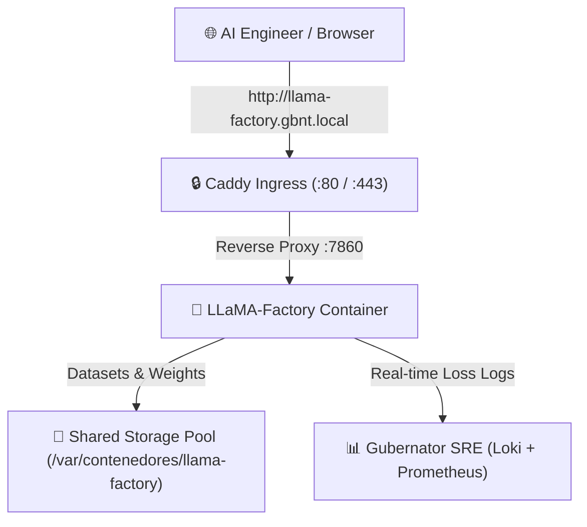

# 🦙 LLaMA-Factory Visual Fine-Tuning Studio

Deploy **LLaMA-Factory**, the state-of-the-art visual suite for fine-tuning, evaluating, and exporting Open-Source Large Language Models (LLMs) like **Llama 3 / 3.2**, **Qwen 2.5**, **DeepSeek**, **Mistral**, and **SmolLM** on Gubernator clusters.

---

## 🏛 Architecture Overview



---

## 🚀 Compose Blueprint

```yaml
version: "3.8"

services:
  llama-factory:
    image: hiyouga/llama-factory:latest
    container_name: llama_factory_studio
    restart: unless-stopped
    ports:
      - "127.0.0.1::7860"
    environment:
      - GRADIO_SERVER_NAME=0.0.0.0
      - GRADIO_SERVER_PORT=7860
      - USE_MODELSCOPE_HUB=0
    volumes:
      - /var/contenedores/llama-factory/data:/app/data
      - /var/contenedores/llama-factory/saves:/app/saves
      - /var/contenedores/llama-factory/output:/app/output
      - /var/contenedores/llama-factory/hf_cache:/root/.cache/huggingface
    deploy:
      resources:
        limits:
          memory: 12G
        reservations:
          memory: 4G
      placement:
        constraints:
          - stack.name == llama-factory-stack
          - ingress.host == llama-factory.gbnt.local
          - gbnt.caddy.port == 7860
          - node.labels.gbnt.node.role == worker
```

---

## 🎯 Visual Training Workflow

1. **Model Selection**: Choose base model (e.g. `HuggingFaceTB/SmolLM-135M-Instruct` or `Qwen/Qwen2.5-0.5B-Instruct`).
2. **Training Stage**: Select **Supervised Fine-Tuning (SFT)** with **LoRA** or **QLoRA (4-bit)**.
3. **Dataset Selection**: Select pre-loaded dataset (`gubernator_qa`).
4. **Hyperparameters**: Set Learning Rate (`5e-5`), Epochs (`3.0`), LoRA Rank (`8`), and LoRA Alpha (`16`).
5. **Start Training**: Click **Start** and inspect the real-time loss curves in the WebUI and streaming stdout logs in the **Loki Logs Explorer**.
6. **Export to GGUF**: Export the adapted weights to GGUF format for instant deployment into Ollama or vLLM inference endpoints.
