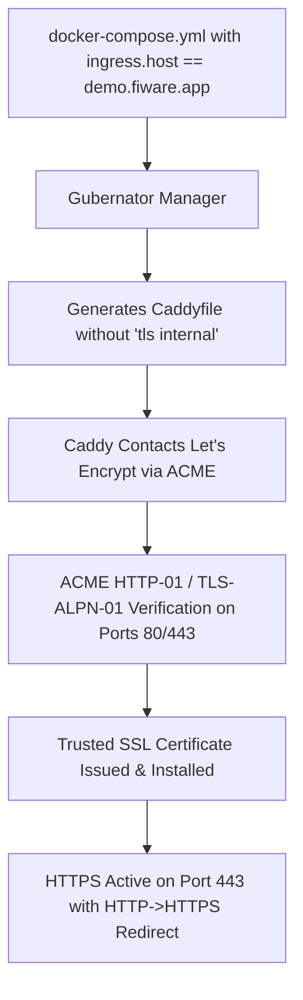

# Example: Automatic Public HTTPS with Let's Encrypt

This guide explains how to deploy a web application in Gubernator attached to a **public domain you own** (e.g. `demo.fiware.app`), and how Gubernator's Caddy Ingress automatically provisions trusted **Let's Encrypt / ZeroSSL SSL/TLS certificates**.

---

## ⚙️ How it Works



When Gubernator detects a public domain (not ending in `.local`, `.internal`, `.lan`, or `localhost`), it automatically allows Caddy to execute its **Automatic HTTPS** protocol.

---

## 📝 Docker Compose File

Save the following file as `docker-compose.yml`:

```yaml
version: '3.8'

services:
  web:
    image: nginxdemos/hello:plain-text
    ports:
      - "80" # Target container port
    deploy:
      replicas: 2
      placement:
        constraints:
          - stack.name == production-demo
          # Public domain for Automatic Let's Encrypt HTTPS:
          - ingress.host == demo.fiware.app
          # (Optional) ACME email for certificate expiration alerts:
          - ingress.email == admin@fiware.app
```

---

## 📋 Step-by-Step Instructions

### Step 1: Configure DNS
Create an `A` record in your DNS provider pointing to your cloud instance's **external public IP**:
```text
demo.fiware.app   300   IN   A   <YOUR_EXTERNAL_PUBLIC_IP>
```
> [!NOTE]
> **Cloud 1:1 NAT (Google Cloud / AWS / Azure)**: If your VM only displays a private internal IP (e.g. `10.128.0.2` or `172.31.x.x`), point your DNS to the **External Public IP** provided by GCP/AWS. Caddy does not need to know the public IP; the cloud provider forwards incoming traffic from the public IP to the private IP automatically.

### Step 2: Open Ingress Ports
Ensure your cloud firewall (AWS Security Group, Hetzner Firewall, GCP VPC Firewall, etc.) allows inbound traffic on:
* **Port 80 TCP** (HTTP & ACME HTTP-01 challenge)
* **Port 443 TCP** (HTTPS & ACME TLS-ALPN-01 challenge)

### Step 3: Deploy with Gubernator
```bash
gbnt stack deploy -c docker-compose.yml production-demo
```

### Step 4: Test in Browser & Inspect Certificate
1. Open `https://demo.fiware.app` in your browser.
2. In the Gubernator Dashboard, navigate to **Caddy Ingress ➔ TLS Certs** to inspect the live Let's Encrypt certificate details, issuer, validity period, and SANs.
