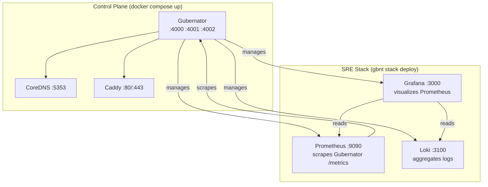

# SRE-01 — Full Site Reliability Engineering Stack

This is the **most advanced example**. It deploys a complete SRE observability stack (Prometheus + Grafana + Loki) as a **Gubernator-managed application**, scheduled and executed by Gubernator itself on top of the Empire control plane.

---

## Architecture



---

## Prerequisites

- Docker and Docker Compose
- `gbnt` binary compiled:
  ```bash
  go build -o gbnt ./cmd/gbnt
  ```

---

## Step 1: Launch the Control Plane

```bash
cd examples/SRE-01
docker compose up -d
```

| Container | Ports | Description |
|-----------|-------|-------------|
| `gubernator-manager` | 4000 / 4001 / 4002 | Orchestrator + Web UI + Telemetry |
| `coredns` | 5353/udp | Internal DNS |
| `caddy` | 80 / 443 | Ingress |

```bash
curl http://localhost:4002/health
# → {"status":"healthy"}
```

Open [http://localhost:4001](http://localhost:4001) (admin/admin).

---

## Step 2: Register a Local Worker

```bash
# Get the join token automatically
TOKEN=$(curl -s -H "Authorization: Bearer admin" \
  http://localhost:4000/v1/cluster/token | \
  python3 -c "import sys,json; print(json.load(sys.stdin)['token'])")

echo "Token: $TOKEN"

# Join as local worker
export GBNT_API_TOKEN=admin
./gbnt legion join --token $TOKEN --manager localhost:4000
```

Leave this terminal running.

---

## Step 3: Deploy the SRE Monitoring Stack

```bash
export GBNT_API_TOKEN=admin
./gbnt stack deploy -c examples/SRE-01/monitoring-stack.yml sre-monitoring
```

Gubernator will:

1. Parse `monitoring-stack.yml` → 3 services (Prometheus, Grafana, Loki)
2. Schedule 1 task per service to the active worker
3. Pull images and start containers (may take 1-2 minutes)

Watch the progress in real-time at [http://localhost:4001](http://localhost:4001).

---

## Step 4: Verify

```bash
# Check all tasks are running
./gbnt task ls

# Check containers
docker ps | grep gbnt
```

### Access the SRE Stack

| Service | URL | Credentials |
|---------|-----|-------------|
| Gubernator Web UI | [http://localhost:4001](http://localhost:4001) | admin / admin |
| Prometheus | [http://localhost:9090](http://localhost:9090) | — |
| Grafana | [http://localhost:3000](http://localhost:3000) | admin / admin |
| Loki | [http://localhost:3100/ready](http://localhost:3100/ready) | — |
| Gubernator Metrics | [http://localhost:4002/metrics](http://localhost:4002/metrics) | — |
| Gubernator Swagger | [http://localhost:4002/swagger/index.html](http://localhost:4002/swagger/index.html) | — |

---

## Step 5: Configure Prometheus to Scrape Gubernator

Gubernator exposes Prometheus metrics at `:4002/metrics`. To add a scrape job, edit your Prometheus config or mount a `prometheus.yml`:

```yaml
scrape_configs:
  - job_name: 'gubernator'
    scrape_interval: 15s
    static_configs:
      - targets: ['host.docker.internal:4002']
```

!!! note
    `host.docker.internal` resolves to the Docker host IP from inside a container on Mac/Windows. On Linux, use the gateway IP (usually `172.17.0.1`) or `--add-host=host.docker.internal:host-gateway`.

---

## Step 6: Scale a Service

=== "Via CLI"

    ```bash
    export GBNT_API_TOKEN=admin

    # Find the Grafana service ID
    ./gbnt service ls

    # Scale to 2 replicas
    ./gbnt service scale <grafana_service_id>=2
    ```

=== "Via Web UI"

    1. Open [http://localhost:4001](http://localhost:4001)
    2. Find `sre-monitoring` → click **Edit YAML**
    3. Change `replicas: 1` to `replicas: 2` under `grafana`
    4. Click **Save & Redeploy**

---

## Step 7: View Metrics in Grafana

1. Open [http://localhost:3000](http://localhost:3000) → login admin/admin
2. Go to **Configuration → Data Sources → Add Prometheus**
3. URL: `http://host.docker.internal:9090` → Save & Test
4. Go to **Explore** → Query: `up` → See Gubernator appearing as a target

---

## Step 8: Clean Up

```bash
export GBNT_API_TOKEN=admin

# List stacks
./gbnt stack ls

# Remove the SRE monitoring stack (stops Prometheus, Grafana, Loki)
./gbnt stack rm <sre_stack_id>

# Shut down the control plane
cd examples/SRE-01
docker compose down -v
```

---

## Source Files

All files are in [`examples/SRE-01/`](https://github.com/mario-ezquerro/gubernator/tree/main/examples/SRE-01) in the repository.
