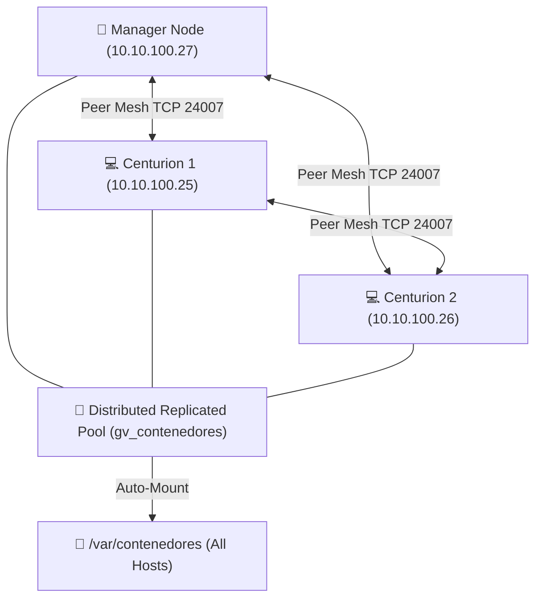

# 🧱 GlusterFS Multi-Node Cluster Storage

Gubernator provides enterprise distributed filesystem management powered by **GlusterFS**, delivering 3-way replicated shared volume mobility (`/var/contenedores`) across Centurion nodes.

---

## 🏛 Storage Pool Architecture



---

## 🚀 Key Features

* **3-Way Mirrored Volumes (Replica 3)**: Automatic distributed volume creation, starting, stopping, and container write-behind cache optimizations (`performance.write-behind`, `flush-behind`, `stat-prefetch`).
* **Trusted Storage Pool Peer Mesh**: Live peer discovery, health probing, latency checks, and quorum diagnostics across Centurion worker hosts.
* **Granaries `/var/contenedores` Auto-Mount**: One-click automated mounting across all cluster nodes directly syncing with Gubernator's `/etc/fstab` management.
* **Ghost Volume Auto-Purge**: Intelligent detection and cleanup of stale volume states with 1-click force recreation.
* **Self-Healing & Split-Brain Diagnostics**: Real-time heal entry queues, brick health inspection, and manual self-heal triggers.
* **Point-in-Time Snapshots**: Instant hot snapshots of GlusterFS distributed volumes with 1-click rollback.

---

## 💻 CLI Commands

```bash
# Volume Management
gbnt gluster volume ls
gbnt gluster volume create gv_contenedores --replica 3 --brick-dir /data/glusterfs/brick1
gbnt gluster volume start gv_contenedores
gbnt gluster volume stop gv_contenedores
gbnt gluster volume heal gv_contenedores

# Storage Pool Peers
gbnt gluster peer ls
gbnt gluster peer probe 10.10.100.25

# Cluster Auto-Mount
gbnt gluster mount gv_contenedores /var/contenedores --nodes all
```
