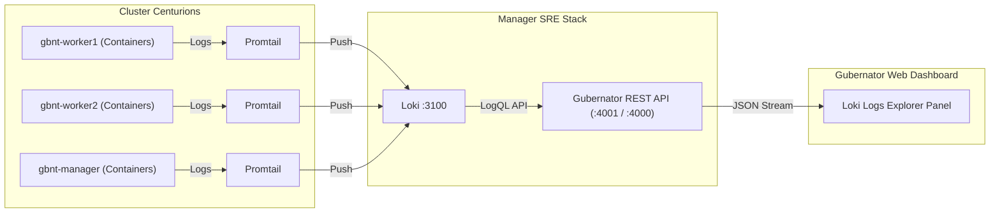

# Loki Logs Explorer

Gubernator features a native, dedicated **Loki Logs Explorer** in the Web UI dashboard for real-time cluster-wide container and node log inspection, powerful multi-dimensional filtering, and live stream tailing.

---

## 🎯 Architecture & Data Flow



1. **Promtail**: Scrapes Docker container logs (`/var/lib/docker/containers/*`) and system logs across every node in the cluster, tagging entries with `container`, `container_name`, `image`, `stream`, and `host`.
2. **Loki (`:3100`)**: Ingests, indexes, and stores log streams in compressed chunks.
3. **Gubernator REST Engine**: Exposes `/api/logs/query`, `/api/logs/labels`, `/api/logs/status`, and `/api/logs/export` with authentication and RBAC.
4. **Loki Logs Explorer**: Interactive Flutter Web console with search, filtering, and live tailing.

---

## 🔍 Features & Filtering Capabilities

| Feature | Description |
|---|---|
| **Text / Regex Search** | Search through log messages using keywords, status codes (e.g. `500`, `401`), or regular expressions with real-time text highlighting. |
| **Node Filter** | Filter logs by specific Centurion node (e.g. `gbnt-manager`, `gbnt-worker1`, `gbnt-worker2`). |
| **Container / Service Filter** | Narrow down logs to a specific container (`gbnt-caddy`, `gbnt-coredns`, `gbnt-manager`, etc.). Clicking on any container pill in the console automatically applies this filter. |
| **Log Level Filter** | Fast filter chips for `All`, `ERROR` (red), `WARN` (amber), `INFO` (blue). |
| **Stream Filter** | Toggle between `stdout` and `stderr` streams. |
| **Time Range Selector** | Choose from presets: `Last 5m`, `Last 15m`, `Last 1h`, `Last 6h`, `Last 24h`, and `Last 7d`. |
| **Line Limits** | Select `50`, `100`, `200`, `500`, or `1000` log lines per query. |
| **Live Tail Mode** | Toggle `🟢 Live Tail: ON` to continuously stream new logs every 3 seconds. |
| **Structured Metadata Inspection** | Click any log row to expand structured labels, exact nanosecond timestamps, and stream properties. |
| **Export Logs** | Download the currently filtered logs as a standard `.log` file (`GET /api/logs/export`). |

---

## 📡 REST API Endpoints

### 1. Check Loki Aggregator Status
```http
GET /api/logs/status
```
**Response:**
```json
{
  "active": true,
  "driver": "loki",
  "url": "http://127.0.0.1:3100"
}
```

### 2. Fetch Available Filter Labels
```http
GET /api/logs/labels
```
**Response:**
```json
{
  "containers": ["gbnt-caddy", "gbnt-coredns", "gbnt-manager", "billing-api", "hello-app"],
  "nodes": [{"id": "node-1", "name": "gbnt-manager", "ip": "192.168.252.27"}],
  "stacks": [{"name": "CORE-GBNT"}, {"name": "hello-lb"}],
  "streams": ["stdout", "stderr"],
  "levels": ["ERROR", "WARN", "INFO", "DEBUG"]
}
```

### 3. Query Logs
```http
GET /api/logs/query?container=gbnt-manager&level=ERROR&range=1h&limit=50
```
**Response:**
```json
{
  "status": "success",
  "driver": "loki",
  "total": 3,
  "logs": [
    {
      "timestamp": "2026-08-17 21:48:26.222",
      "timestamp_ns": "1787003306222452705",
      "container": "gbnt-manager",
      "node": "manager",
      "stream": "stdout",
      "level": "INFO",
      "message": "[GIN] 2026/08/17 - 21:48:26 | 200 | GET /v1/node/tasks",
      "labels": {
        "job": "docker",
        "service_name": "docker",
        "stream": "stdout"
      }
    }
  ]
}
```

### 4. Export Logs to File
```http
GET /api/logs/export?container=gbnt-caddy&range=24h
```
Downloads attachment `gubernator-logs-YYYYMMDD-HHMMSS.log`.

---

## 🛡️ Graceful Docker CLI Fallback

If Loki is temporarily starting or the SRE monitoring stack is disabled, Gubernator automatically falls back to scraping local Docker container logs (`docker logs --tail ...`) ensuring log visibility is never interrupted.
