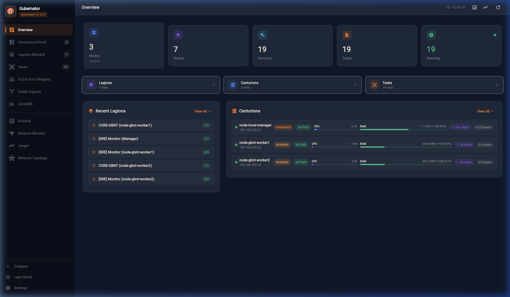
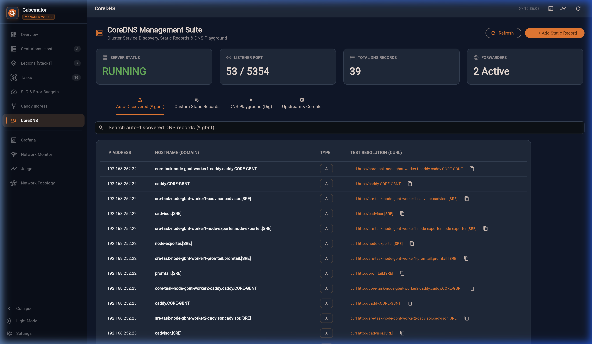
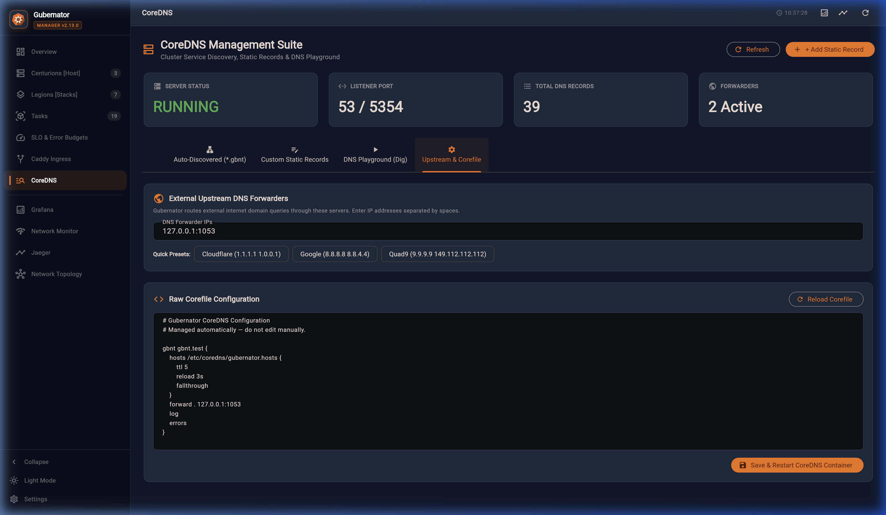
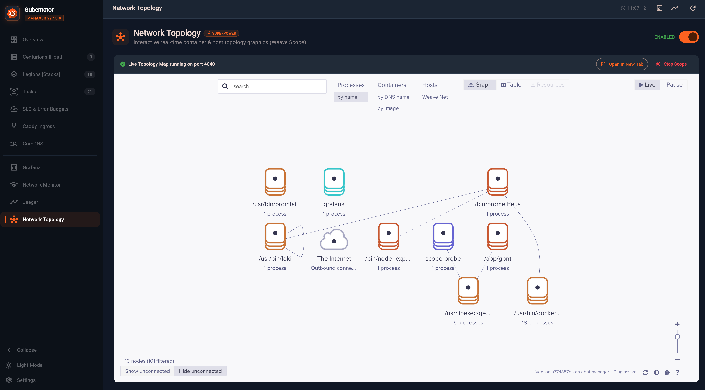
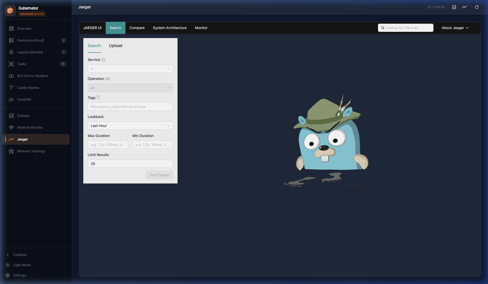
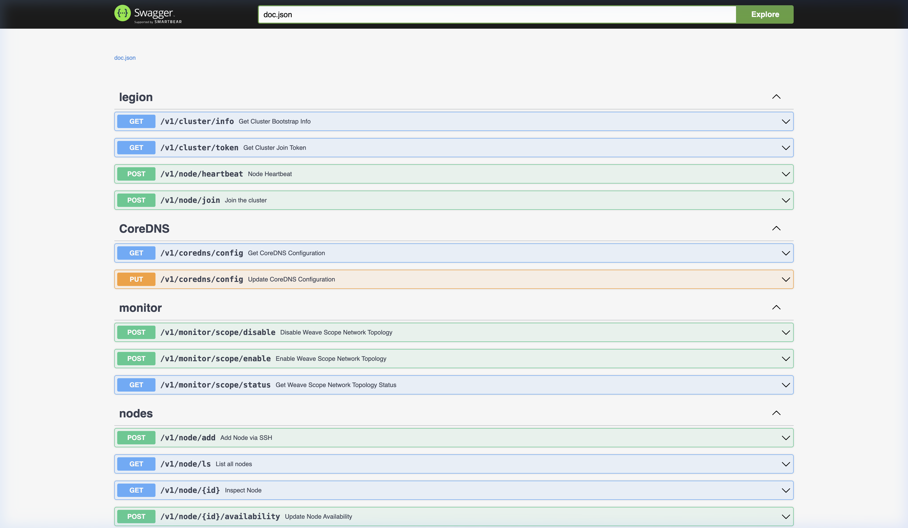

# Gubernator v2.13.0 — Visual Gallery & Screenshots

This gallery showcases the key visual features, suites, and user interfaces available in **Gubernator v2.13.0**.

---

## 📊 1. Web Dashboard (`dashboard_main.png`)

The central command center for Gubernator. Features:
- **Legions & Centurions Split View**: Dual-panel showing Stacks/Services on the left (1/3) and Cluster Nodes on the right (2/3).
- **Clickable Port Chips**: Container ports rendered as interactive chips that open the hosted web service directly in a new browser tab.
- **Node Shell & Actions**: Quick access to terminal sessions, node reboot, and status management.

---

## 🔒 2. Caddy Ingress Suite (`caddy_ingress_suite.png`)

Full multi-node Caddy proxy management interface:
- **7-Tab Management**: Dashboard, Routes, Caddyfile editor, TLS Certificates, Access Logs, Log Config, and Prometheus Metrics.
- **Dynamic Route Sync**: Automatic reverse proxy routing to containers deployed in the cluster.

---

## 🌐 3. CoreDNS DNS Suite (`coredns_suite_auto.png`)

Internal service discovery and DNS management:
- **Automatic Host Records**: Real-time DNS record generation (`<service>.<stack>.gbnt.local`) for container communication.
- **Custom DNS Records**: Ability to add custom domain mappings across the cluster.

### CoreDNS Corefile Editor (`coredns_suite_corefile.png`)

Direct in-browser Corefile editing and validation.

### Custom DNS & Playground (`coredns_suite_custom.png` & `coredns_suite_playground.png`)

Custom DNS record setup and instant DNS testing playground.

### CoreDNS Record Creation (`coredns_add_dialog.png`)

Modal dialog for adding custom A/AAAA/CNAME DNS records.

### Built-in DNS Dig Tool (`dns_dig_result.png`)

Integrated dig execution output for verifying internal DNS resolutions.

---

## 🎯 4. Service Level Objectives (SLO Engine) (`slo_management_suite.png`)

Google SRE-grade SLO & Error Budget tracking powered by Sloth (`slok/sloth`):
- **Real-time Burn Rate & Error Budget**: Displays real-time error budgets, multi-window burn rate alerts, and SLO compliance percentage.
- **SLO Labels Sync**: Automatic conversion of Compose `gbnt.slo.*` labels into Prometheus recording & alerting rules.

### SLO Comparison Dashboard (`comparativa-slo.png`)

Comparative view of service availability targets vs actual performance.

---

## 🕸️ 5. Network Topology & Microservice Map (`network-topology.png`)

Interactive visualization of cluster nodes, active containers, network routes, and interconnects.

### Weave Scope Embedded View (`network_scope_topology.png`)

Real-time container network flow and process mapping powered by Weave Scope.

---

## 📑 6. OpenAPI / Swagger Documentation (`swagger_api_docs.png`)

Interactive REST API documentation on port `:4002/swagger/index.html`. Full endpoint coverage for Stacks, Services, Nodes, Tasks, SLOs, and CoreDNS.
