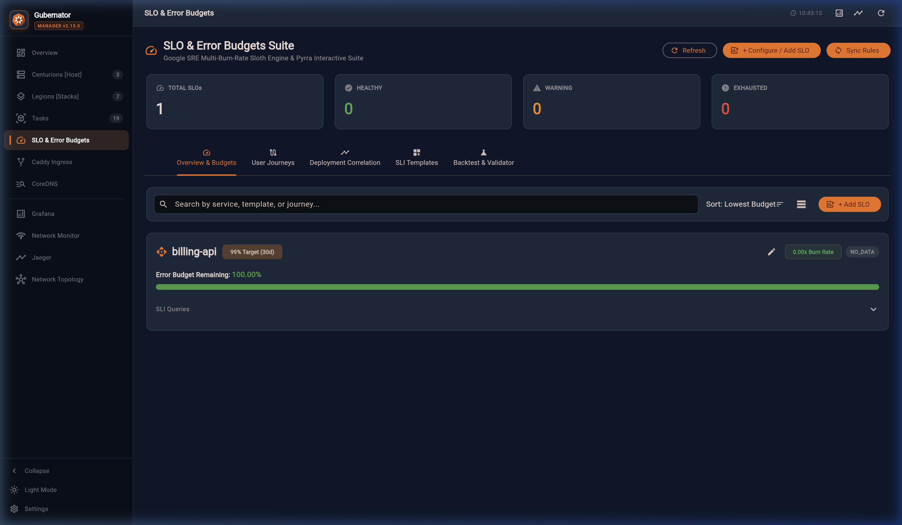
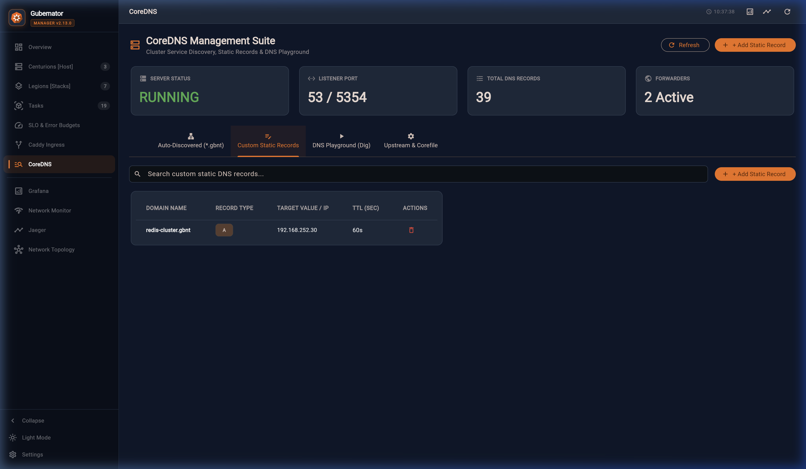
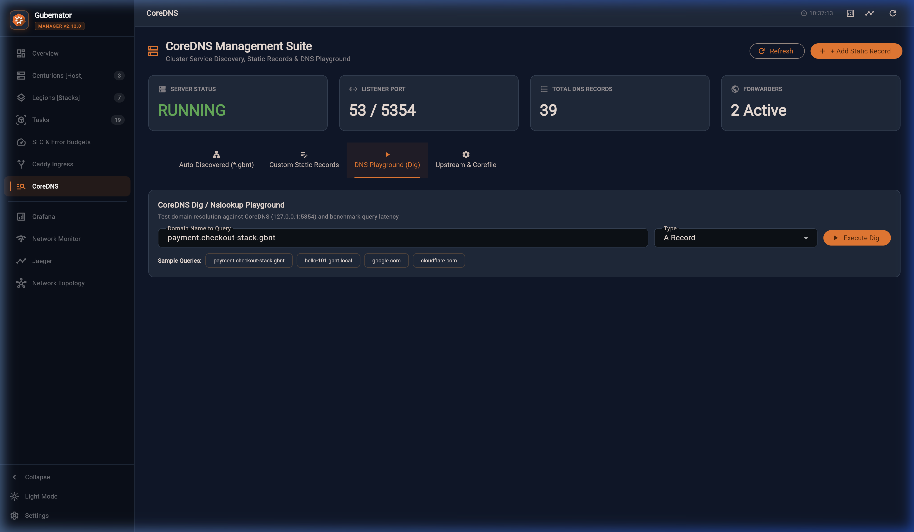
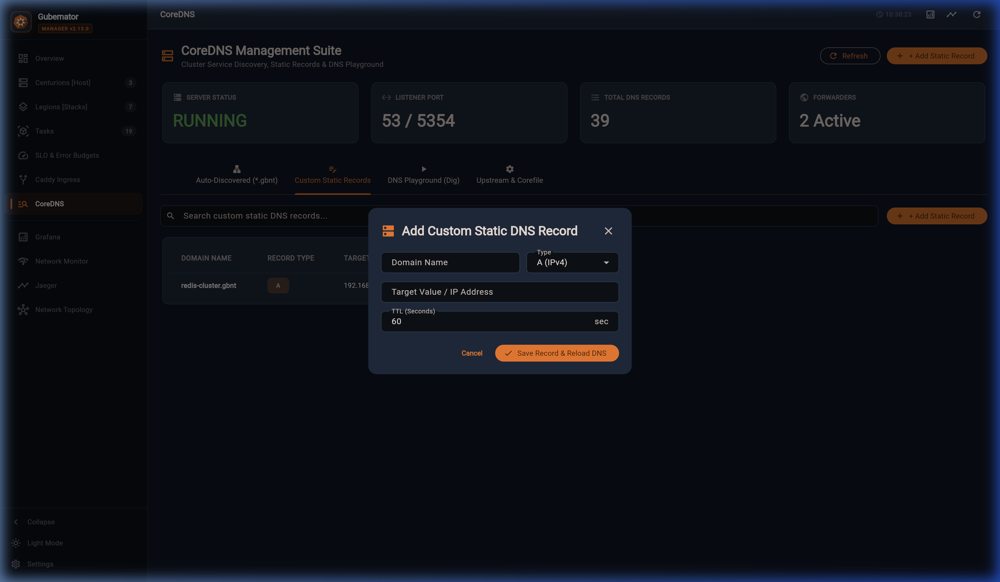
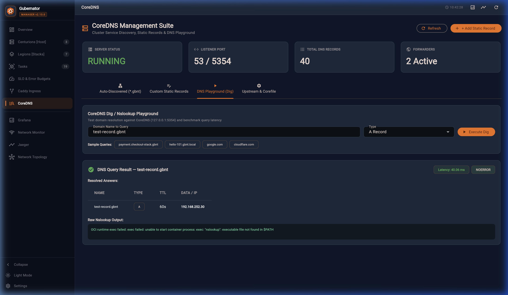
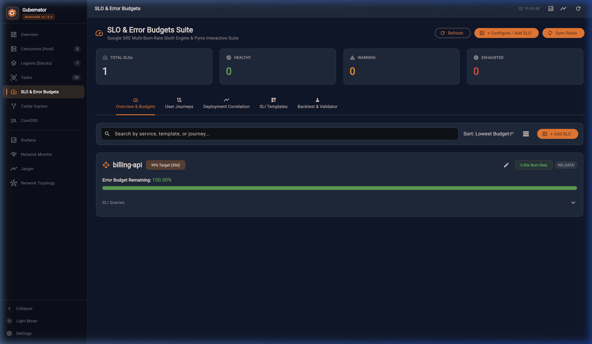
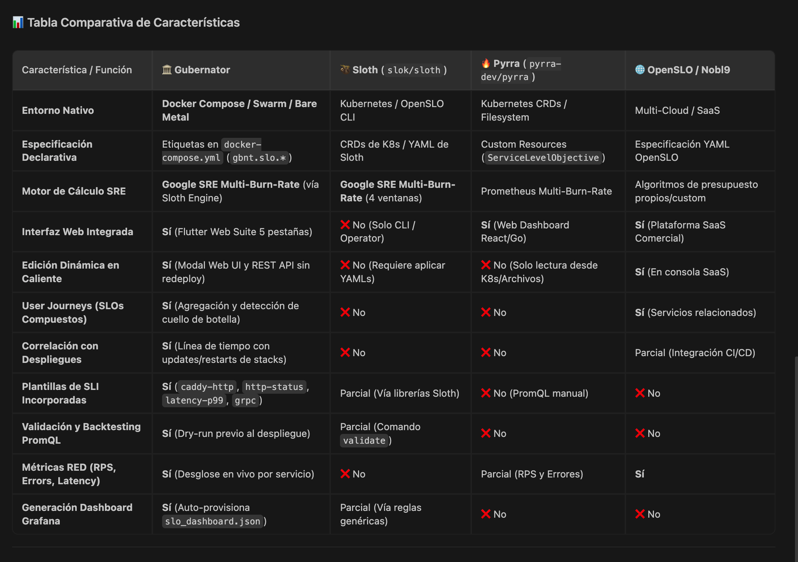

# Gubernator v2.13.0 — Visual Gallery & Screenshots

This gallery showcases the key visual features, suites, and user interfaces available in **Gubernator v2.13.0**.

---

## 📊 1. Web Dashboard (`dashboard_main.png`)

The central command center for Gubernator. Features:
- **Legions & Centurions Split View**: Dual-panel showing Stacks/Services on the left (1/3) and Cluster Nodes on the right (2/3).
- **Clickable Port Chips**: Container ports rendered as interactive chips that open the hosted web service directly in a new browser tab.
- **Node Shell & Actions**: Quick access to terminal sessions, node reboot, and status management.

---

## 🔒 2. Caddy Ingress Suite (`caddy_ingress_suite.png`)

Full multi-node Caddy proxy management interface:
- **7-Tab Management**: Dashboard, Routes, Caddyfile editor, TLS Certificates, Access Logs, Log Config, and Prometheus Metrics.
- **Dynamic Route Sync**: Automatic reverse proxy routing to containers deployed in the cluster.

---

## 🌐 3. CoreDNS DNS Suite (`coredns_suite_auto.png`)

Internal service discovery and DNS management:
- **Automatic Host Records**: Real-time DNS record generation (`<service>.<stack>.gbnt.local`) for container communication.
- **Custom DNS Records**: Ability to add custom domain mappings across the cluster.

### CoreDNS Corefile Editor (`coredns_suite_corefile.png`)

Direct in-browser Corefile editing and validation.

### Custom DNS & Playground (`coredns_suite_custom.png` & `coredns_suite_playground.png`)

Custom DNS record setup and instant DNS testing playground.

### CoreDNS Record Creation (`coredns_add_dialog.png`)

Modal dialog for adding custom A/AAAA/CNAME DNS records.

### Built-in DNS Dig Tool (`dns_dig_result.png`)

Integrated dig execution output for verifying internal DNS resolutions.

---

## 🎯 4. Service Level Objectives (SLO Engine) (`slo_management_suite.png`)

Google SRE-grade SLO & Error Budget tracking powered by Sloth (`slok/sloth`):
- **Real-time Burn Rate & Error Budget**: Displays real-time error budgets, multi-window burn rate alerts, and SLO compliance percentage.
- **SLO Labels Sync**: Automatic conversion of Compose `gbnt.slo.*` labels into Prometheus recording & alerting rules.

### SLO Comparison Dashboard (`comparativa-slo.png`)

Comparative view of service availability targets vs actual performance.

---

## 🕸️ 5. Network Topology & Microservice Map (`network-topology.png`)

Interactive visualization of cluster nodes, active containers, network routes, and interconnects.

### Weave Scope Embedded View (`network_scope_topology.png`)

Real-time container network flow and process mapping powered by Weave Scope.

---

## 📑 6. OpenAPI / Swagger Documentation (`swagger_api_docs.png`)

Interactive REST API documentation on port `:4002/swagger/index.html`. Full endpoint coverage for Stacks, Services, Nodes, Tasks, SLOs, and CoreDNS.

---

## 🛡️ 7. Enterprise Active Directory, LDAP & RBAC (`v2.20.0`)

### Modern Login Screen & Domain Selector

Enterprise SSO login screen supporting Active Directory domains, OpenLDAP directories, and local emergency administrator authentication.

### Security & Active Directory Management Suite

Full management interface for Directory Servers, dynamic RBAC group mappings, live "Test Connection" diagnostic tool, and cluster API security tokens.

---

## 🏛️ 8. Universal Centurion Onboarding Suite & Live Terminal Console (`v2.60.0`)

Full 3-tab onboarding dialog accessible from **Centurions [Host] ➔ Add Centurion**:
- **⚡ Quick Join (Copy & Paste)**: 1-click command cards for One-Liner Auto-Installer (`curl ... | sudo bash`), Docker Container (`legion join`), and CLI binary.
- **🚀 Remote SSH Provisioning**: Multi-auth form supporting Password, SSH Private Key (.pem), and Manager Public Key auto-discovery.
- **📺 Live Monospace Terminal Console**: Real-time progress console streaming SSH connection, hardware discovery, Docker CE verification, agent deployment, and system stacks synchronization.
- **☁️ Cloud-Init & Automation (IaC)**: Ready-to-copy `#cloud-config` YAML blueprint for automated VM provisioning.

---

## 🛡️ 9. Image Security Auto-Remediation & Safe Rollback (`v2.61.0`)

Interactive remediation modal accessible via **`⚡ Fix Image`** on any vulnerable image card or CVE scan details dialog in **Security & SBOM**:
- **Risk & Impact Assessment**: Automatic calculation of operational risk levels (`LOW`, `MEDIUM`, `HIGH`) with warnings for database schema migrations and persistent volume checks.
- **Version Candidate Selector**: Smart recommendation of safe security patches (same major version, Alpine minimal variant) vs modern stable releases.
- **🛡️ Safe Automated Rollback**: Automatically reverts `docker-compose.yml` to the previous cryptographic backup if updated containers crash or fail healthchecks within 20 seconds.
- **📺 Live Execution Console**: Real-time monospace terminal displaying backup creation, image patching, rolling redeployment, health probing, and re-scanning progress.
- **📝 Compose Studio Integration**: Instant deep-link to edit the Compose file manually in Compose Studio.

---

## 🔨 10. Docker Host Image Lifecycle, Layer Inspector & The Imperial Forge (`v2.62.0`)

Full container image engineering and host maintenance suite inside **Image Security & SBOM**:
- **🧹 Cluster Host Image Pruner**: 1-click `docker image prune -a -f` across the Manager and all Centurion worker nodes, calculating reclaimed disk space (MB/GB).
- **📜 Layer History & Reverse-Engineered Dockerfile (`ImageHistoryDialog`)**: Interactive chronological timeline showing individual layer commands, incremental sizes (+MB), and reverse-engineered `Dockerfile` with 1-click clipboard export and "Edit & Rebuild in Forge" bridge.
- **🔨 The Imperial Forge — Image Build Studio (`ImageBuildDialog`)**: In-browser Dockerfile builder with built-in production blueprints (Alpine Hardened, Go Multi-stage, Node.js, Python FastAPI), multi-node Centurion build targeting, build args, and real-time streaming compilation terminal.

---

## 🔏 11. Streamlined In-Cluster Image Signing & Keypair Selector (`v2.62.1`)

Interactive cryptographic signing suite accessible from **Image Security & SBOM ➔ `Sign Image`** and 1-click **`🔏 Sign`** buttons:
- **🔑 In-Cluster Keypair Persistence**: Stores ECDSA P-256 private keys securely inside the cluster database, eliminating manual key copy-pasting.
- **🖼️ Searchable Image Selector**: Autocompletes across all cluster stacks and host containers.
- **🛡️ Docker Digest Discovery**: Automatically extracts SHA-256 RepoDigests via Docker engine inspect to sign the exact container bytecode.
- **⚡ Gatekeeper Admission**: Instant transition to `VERIFIED` status satisfying Zero-Trust admission policies.

