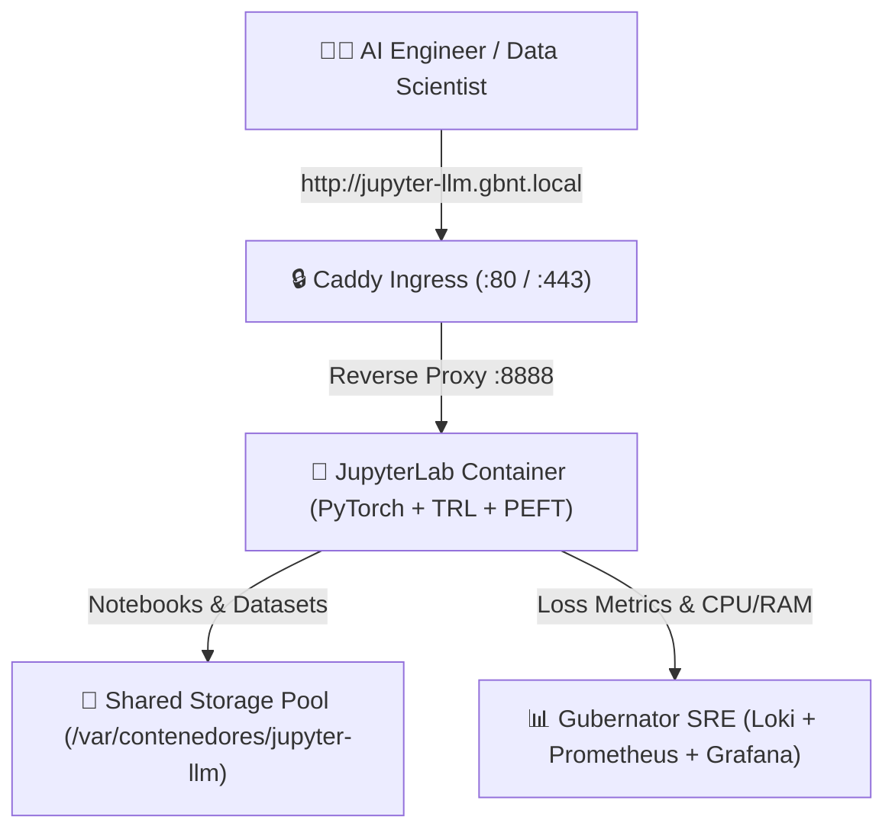

# 🧪 JupyterLab PyTorch LLM Training & Fine-Tuning Lab on Gubernator

This blueprint deploys an enterprise **JupyterLab Data Science & AI Workspace** pre-configured with **PyTorch**, **Hugging Face Transformers**, **TRL (SFTTrainer)**, and **PEFT (LoRA/QLoRA)**.

---

## 🏛 Architecture Overview



---

## 🚀 Quick Start Deployment

### 1. Create Cluster Shared Storage Directories
```bash
sudo mkdir -p /var/contenedores/jupyter-llm/work
sudo mkdir -p /var/contenedores/jupyter-llm/hf_cache
sudo chmod -R 777 /var/contenedores/jupyter-llm
```

Copy the ready-to-run notebook and training script into the shared workspace:
```bash
cp -r notebooks/* /var/contenedores/jupyter-llm/work/
cp train_script.py /var/contenedores/jupyter-llm/work/
```

### 2. Deploy via Gubernator CLI
```bash
gbnt stack deploy -c docker-compose.yml jupyter-llm-stack
```

### 3. Access JupyterLab Web Interface
* **URL:** `http://jupyter-llm.gbnt.local` (or click the mapped port in the Gubernator Web Dashboard)
* **Access Token:** `gubernator-secret`

---

## 🔬 Running the Interactive Fine-Tuning Notebook

1. In the JupyterLab file browser, double-click **`llm_lora_finetuning.ipynb`**.
2. Run cells sequentially:
   * **Step 1:** Verifies PyTorch, CPU/GPU hardware, and installs HuggingFace packages.
   * **Step 2:** Prepares the domain-specific instruction dataset in ChatML format.
   * **Step 3:** Loads the base model (`HuggingFaceTB/SmolLM-135M-Instruct` or `Qwen2.5-0.5B`).
   * **Step 4:** Attaches LoRA adapter layers (`r=8, alpha=16`).
   * **Step 5:** Executes `SFTTrainer` with live loss tracking and progress bars.
   * **Step 6:** Performs a live inference test on the newly trained weights.
   * **Step 7:** Saves the adapted LoRA weights to `/home/jovyan/work/output/`.

---

## ⚡ Headless Script Execution (Batch Job)

You can also run the training pipeline headlessly from terminal or within a batch container:

```bash
python3 /home/jovyan/work/train_script.py
```
