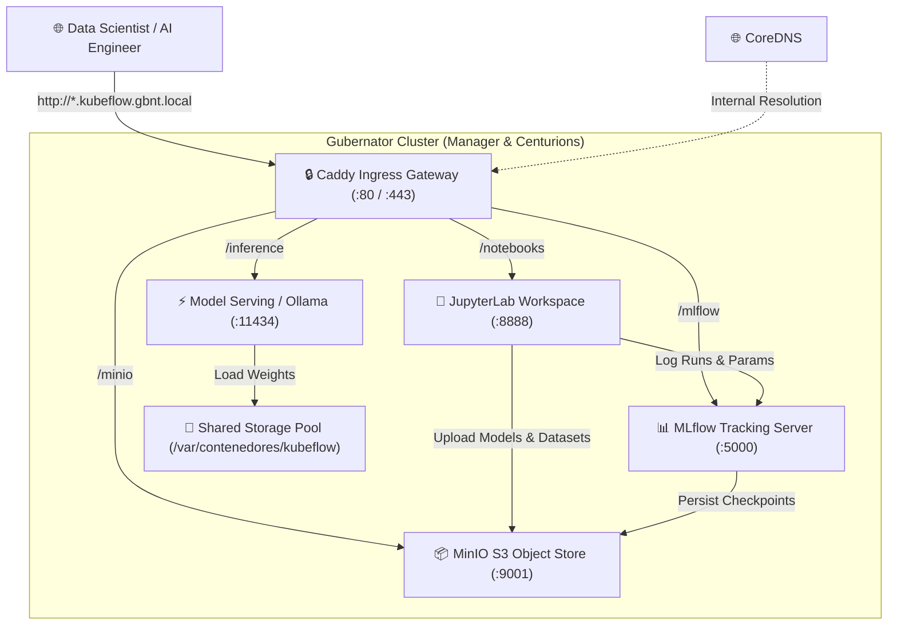

# 🧠 Enterprise Kubeflow MLOps Platform on Gubernator

Deploy a production-grade, fully containerized **Machine Learning & AI Platform** (Kubeflow / MLOps equivalent) on your Gubernator cluster in seconds using native Docker Compose.

---

## 🏛 Architecture Overview



---

## ⚖️ Kubernetes Kubeflow vs. Gubernator MLOps

| Capability | Kubernetes Kubeflow (`manifests`) | Gubernator MLOps (`kubeflow-stack`) |
| :--- | :--- | :--- |
| **Control Plane Overhead** | Heavy (`k8s-apiserver`, `etcd`, `Istio`, `Dex`, 30+ CRDs) | **Ultra-Lightweight** (Go binary + Caddy Ingress) |
| **RAM Consumption** | 16 GB - 32 GB minimum baseline | **< 2 GB** baseline |
| **Deployment Complexity** | Multi-step `kustomize` / Helm overlays | **1-Click** Deploy from Gubernator Compose Studio |
| **Storage Mobility** | Heavy CSI drivers (Ceph-CSI, Rook) | **Granaries** (`/var/contenedores` NFS/GlusterFS mobility) |
| **Interactive Notebooks** | Jupyter Notebook Controller | Official JupyterLab with PyTorch & CUDA |
| **Experiment Tracking** | Kubeflow Metadata / Katib | **MLflow Tracking Server** + Model Registry |
| **Object / Artifact Store** | MinIO S3 | **MinIO S3** with auto-provisioned buckets |
| **Model Serving** | KServe / vLLM / Triton | **vLLM / Ollama** with OpenAI-compatible API |

---

## 🚀 Quick Start Deployment

### Method 1: Gubernator Web Dashboard (1-Click)
1. Open the Gubernator Web UI at `http://localhost:4001` (or your Manager IP).
2. Go to **Compose Studio** in the sidebar.
3. Select **Kubeflow MLOps Platform** from the blueprints dropdown.
4. Click **Deploy Stack**.

### Method 2: Gubernator CLI
```bash
gbnt stack deploy --name kubeflow-stack --file examples/example-kubeflow/docker-compose.yml
```

---

## 🌐 Ingress Endpoints & Credentials

All services are automatically registered into CoreDNS and routed via Caddy Ingress:

| Service | Internal Domain | Default Credentials | Description |
| :--- | :--- | :--- | :--- |
| **JupyterLab** | `http://notebooks.kubeflow.gbnt.local` | Token: `gubernator-secret` | Interactive PyTorch & ML workspace |
| **MLflow Server** | `http://mlflow.kubeflow.gbnt.local` | Open / LDAP RBAC | Experiment metrics, runs, and registry |
| **MinIO S3 Console** | `http://minio.kubeflow.gbnt.local` | User: `kubeflow`<br>Pass: `gubernator123` | S3 datasets and model artifacts |
| **Inference Engine** | `http://inference.kubeflow.gbnt.local` | None (OpenAI API) | High-speed LLM / tensor serving |

---

## 🧪 Running the End-to-End MLOps Pipeline

Run the included automated training and tracking script:

```bash
# 1. Install client dependencies
pip install mlflow scikit-learn numpy boto3

# 2. Execute pipeline
python3 examples/example-kubeflow/pipeline_demo.py
```

### What this pipeline does:
1. Connects to `http://mlflow.kubeflow.gbnt.local`.
2. Streams live epoch loss and accuracy curves to MLflow.
3. Automatically serializes the model and pushes `.pkl` / `.pt` checkpoints to MinIO S3 `s3://mlflow-artifacts/`.
4. Registers the model in the MLflow Model Registry for production inference.
