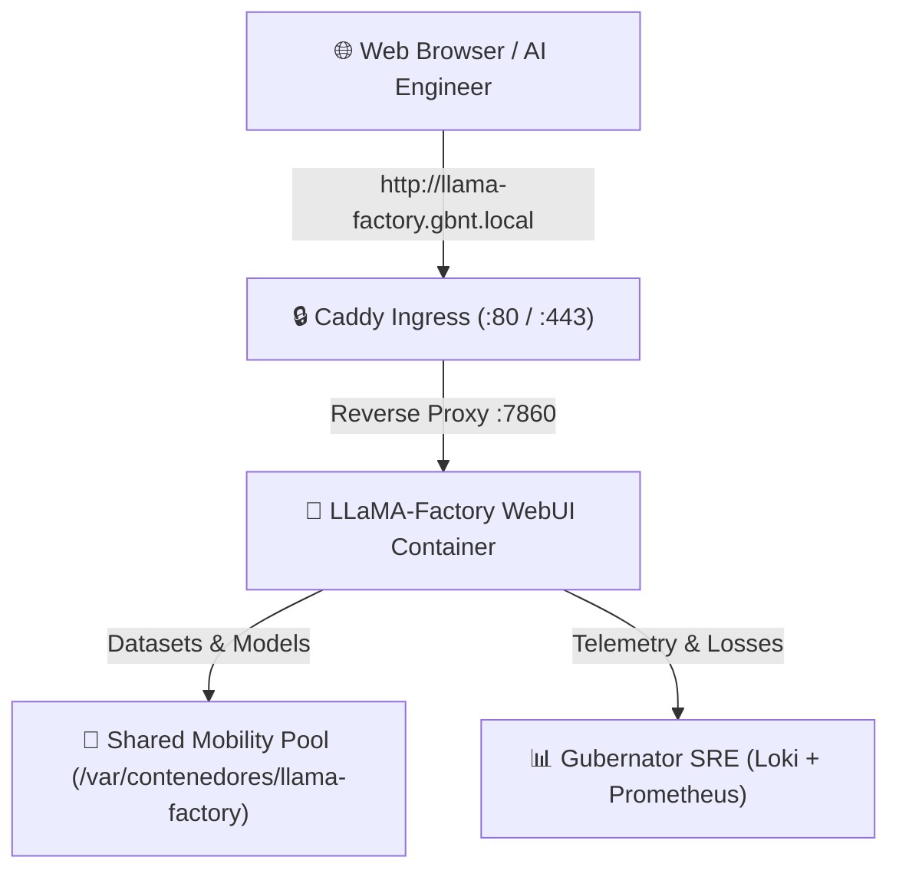

# 🦙 LLaMA-Factory Visual Fine-Tuning Studio on Gubernator

This blueprint deploys **LLaMA-Factory**, a state-of-the-art visual suite for training, fine-tuning, evaluating, and exporting Open-Source Large Language Models (LLMs) like **Llama 3 / 3.2**, **Qwen 2.5**, **DeepSeek**, **Mistral**, and **SmolLM** on a Gubernator cluster.

---

## 🏛 Architecture Overview



---

## 🚀 Deployment Instructions

### 1. Prepare Persistent Shared Directories
Ensure the persistent directories exist across your cluster in `/var/contenedores`:

```bash
sudo mkdir -p /var/contenedores/llama-factory/data
sudo mkdir -p /var/contenedores/llama-factory/saves
sudo mkdir -p /var/contenedores/llama-factory/output
sudo mkdir -p /var/contenedores/llama-factory/hf_cache
sudo chmod -R 777 /var/contenedores/llama-factory
```

Copy the Gubernator sample dataset:
```bash
cp data/* /var/contenedores/llama-factory/data/
```

### 2. Deploy via Gubernator CLI

```bash
gbnt stack deploy -c docker-compose.yml llama-factory-stack
```

### 3. Open Visual Studio in Browser
Navigate to **`http://llama-factory.gbnt.local`** (or access via the mapped container port from the Gubernator Web Dashboard).

---

## 🎯 Fine-Tuning Workflow in LLaMA-Factory WebUI

1. **Model Selection**:
   - **Model Name:** `SmolLM-135M` (for ultra-fast CPU testing) or `Qwen2.5-0.5B` / `Llama-3.2-1B` / `Llama-3-8B`.
   - **Model Path:** Enter HuggingFace repo ID (e.g. `HuggingFaceTB/SmolLM-135M-Instruct` or `Qwen/Qwen2.5-0.5B-Instruct`).

2. **Training Stage**:
   - Select **Supervised Fine-Tuning (SFT)**.
   - Select **LoRA** or **QLoRA (4-bit)** as the Fine-Tuning Method.

3. **Dataset Selection**:
   - Select `gubernator_qa` from the dataset dropdown.

4. **Hyperparameters**:
   - **Learning Rate:** `5e-5`
   - **Epochs:** `3.0`
   - **Batch Size:** `2` (CPU) or `8` (GPU)
   - **LoRA Rank (r):** `8`
   - **LoRA Alpha:** `16`

5. **Start Training**:
   - Click **"Start"**. Follow the real-time loss curve in the WebUI and live stdout logs in the **Gubernator Loki Logs Explorer**.

6. **Export & Quantization**:
   - In the **Export** tab, choose export format (**Safetensors** or **GGUF (Q4_K_M)** for Ollama / vLLM deployment).
