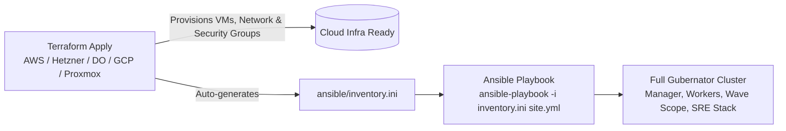

# 🌍 Gubernator Multi-Cloud Terraform Infrastructure Suite

Production-ready **Terraform** configurations to automatically provision virtual machines, networks, firewalls, and security groups for **Gubernator** clusters across major cloud providers and on-premise hypervisors, with **automatic Ansible inventory generation**.

---

## 🏛️ Supported Cloud & Hypervisor Providers

| Provider | Folder | Highlights & Architecture |
| :--- | :--- | :--- |
| **AWS** | [`terraform/aws/`](aws/) | VPC, Public Subnet, Internet Gateway, Security Groups, EC2 (1 Manager + N Workers) |
| **Hetzner Cloud** | [`terraform/hetzner/`](hetzner/) | Private Network, Cloud Firewall, High-performance NVMe ARM64/x86 instances |
| **DigitalOcean** | [`terraform/digitalocean/`](digitalocean/) | VPC, Cloud Firewalls, Tagged Droplets, Flexible sizing |
| **Google Cloud (GCP)** | [`terraform/gcp/`](gcp/) | Custom VPC, Subnetworks, Compute Engine instances with public NAT |
| **Proxmox VE** | [`terraform/proxmox/`](proxmox/) | On-premise homelab VM cloning via Cloud-Init |

---

## ⚡ The Terraform ➔ Ansible Automated Pipeline

Every provider module includes an automated `local_file` template that generates [`ansible/inventory.ini`](../ansible/inventory.example.ini) with all node public IPs and credentials upon `terraform apply`.



---

## 🚀 Quick Start Guide

### Step 1: Choose Your Cloud Provider & Configure Variables

Navigate to the directory of your chosen provider:

```bash
# Example for Hetzner Cloud:
cd terraform/hetzner
cp terraform.tfvars.example terraform.tfvars
nano terraform.tfvars

# Example for AWS:
cd terraform/aws
cp terraform.tfvars.example terraform.tfvars
nano terraform.tfvars

# Example for DigitalOcean:
cd terraform/digitalocean
cp terraform.tfvars.example terraform.tfvars
nano terraform.tfvars

# Example for GCP:
cd terraform/gcp
cp terraform.tfvars.example terraform.tfvars
nano terraform.tfvars
```

### Step 2: Initialize & Apply Terraform

```bash
# Initialize provider plugins
terraform init

# Review execution plan
terraform plan

# Provision infrastructure
terraform apply
```

Upon completion, Terraform will output:
- **Manager Public IP** & **Worker Public IPs**
- **Web UI URL**: `http://<MANAGER_IP>:4001/`
- **Wave Scope Topology UI**: `http://<MANAGER_IP>:4040/`
- **Grafana Monitoring UI**: `http://<MANAGER_IP>:3000/`
- **SSH Command** to connect to Manager
- **Auto-generated file**: `../../ansible/inventory.ini`

---

### Step 3: Run Ansible to Configure the Cluster

With `ansible/inventory.ini` already populated automatically by Terraform:

```bash
cd ../../ansible
ansible-playbook -i inventory.ini site.yml
```

In a single command, Ansible will:
1. Load kernel modules (`overlay`, `br_netfilter`, `nf_conntrack`) and configure `sysctl`.
2. Install official **Docker CE** and optimize `/etc/docker/daemon.json`.
3. Deploy the **Gubernator Manager** service and automatically register all **Centurion Workers**.
4. Launch **Wave Scope** (`marioezquerro/scope:latest`) with host networking for live cluster topology.
5. Spin up the **SRE Observability stack** (Grafana, Loki, Prometheus, Jaeger, cAdvisor).

---

## 🧹 Destroying the Infrastructure

To tear down all provisioned cloud resources and stop billing:

```bash
cd terraform/<chosen_provider>
terraform destroy -auto-approve
```
